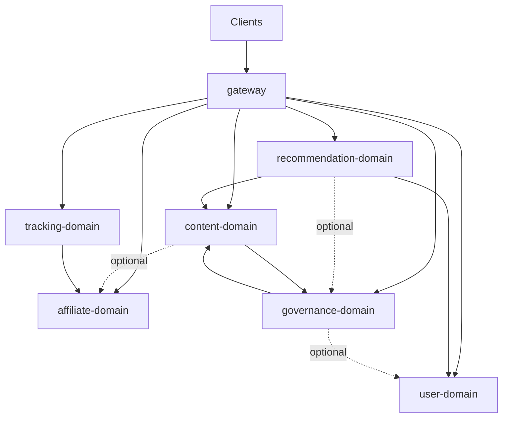

# 技术架构总览

## 1. 架构目标

本项目的技术架构服务于以下四个目标：

1. **高性能**：支撑高并发导购请求、推荐请求与跳转请求
2. **高扩展**：支持新业务主题、新渠道、新终端快速接入
3. **高协作**：支持多人或多 agent 基于统一文档并行开发
4. **高一致**：保证多端业务语义一致，避免“同功能不同实现”

## 2. 总体原则

1. **业务域优先**：服务按业务能力边界拆分，不按技术层级拆分
2. **文档先于实现**：跨服务协作以文档契约为准，代码实现服从文档
3. **客户端轻业务**：客户端负责展示与交互，核心业务规则沉淀在服务端
4. **统一入口**：所有终端通过网关进入后端体系
5. **高内聚低耦合**：一个业务域内的文档、代码、数据和规则尽量放在一起
6. **可观测性内建**：日志、指标、追踪、审计能力不是外挂，而是架构基础能力

## 3. 业务架构视图

项目不再按“衣食住行分别建设独立服务”组织底层系统，而是按稳定的业务能力拆分服务；衣、食、住、行属于内容主题和运营视图，不是底层服务边界。

### 核心业务域

| 业务域 | 核心职责 | 说明 |
|------|------|------|
| **gateway** | 统一入口、鉴权、路由、限流、协议转换 | 对客户端暴露统一访问面 |
| **user-domain** | 用户、偏好、收藏、历史、反馈 | 负责用户画像基础数据 |
| **content-domain** | 导购内容、专题、榜单、商品/服务卡片 | 承载衣食住行的内容实体 |
| **recommendation-domain** | 推荐策略、召回、排序、推荐解释 | 负责把内容匹配给用户 |
| **affiliate-domain** | 联盟平台接入、渠道规则、佣金参数、渠道能力封装 | 负责拼多多、抖音等对接，以及 partner-specific URL 规则、签名与能力抽象 |
| **tracking-domain** | 落地链接组装、跳转链路、点击追踪、归因处理 | 负责对客户端暴露 `landing_url`、转链执行和效果归因 |
| **governance-domain** | 内容审核、运营配置、商业标识、下架控制 | 保障运营和治理效率 |

### 业务主题

衣、食、住、行四个主题统一由 `content-domain + recommendation-domain + governance-domain` 承载，不在底层复制四套相同能力。

这样做的好处是：

- 避免四个品类服务重复建设推荐、搜索、审核、标签等能力
- 新增业务主题时只增加内容配置和策略，不必新造一套服务
- 更适合 AI 协作式开发，边界更稳定，知识沉淀更集中

## 4. 系统架构图

```text
┌────────────────────────────────────────────────────────────────────────────┐
│                                 客户端层                                   │
│      iOS / Android / Web / Mini Program                                   │
│      统一页面定义、统一字段口径、统一核心流程                             │
└───────────────────────────────┬────────────────────────────────────────────┘
                                │ HTTPS + JSON
                                ▼
┌────────────────────────────────────────────────────────────────────────────┐
│                              API Gateway                                   │
│                    路由 / 鉴权 / 限流 / 聚合 / 协议转换                    │
└───────────────────────────────┬────────────────────────────────────────────┘
                                │ brpc
                                ▼
┌────────────────────────────────────────────────────────────────────────────┐
│                               业务域服务层                                 │
│                                                                            │
│  user-domain     content-domain   recommendation-domain                    │
│  affiliate-domain tracking-domain governance-domain                        │
│                                                                            │
│  所有服务通过文档契约定义边界，通过接口和明确依赖协作                      │
└───────────────────────────────┬────────────────────────────────────────────┘
                                │
               ┌────────────────┼────────────────┐
               ▼                ▼                ▼
        MySQL Cluster      Redis Cluster      Kafka Cluster
                                │
                                ▼
┌────────────────────────────────────────────────────────────────────────────┐
│                              平台与治理层                                  │
│ GitLab / GitLab CI / ArgoCD / Bazel / K8s / Istio / Vault /                │
│ Prometheus / Grafana / ELK / Jaeger / Terraform                            │
└────────────────────────────────────────────────────────────────────────────┘
```

## 5. 服务间协作原则

“服务间通过文档交互”在本项目中不是口号，而是硬约束。

### 5.1 交互方式

- 服务不能直接依赖对方的内部实现
- 服务协作必须先定义文档，再定义接口，再进入开发
- 服务只对外暴露稳定契约，不暴露内部规则和内部数据结构

### 5.2 契约优先顺序

1. 业务目标与边界
2. 输入输出定义
3. 字段与枚举说明
4. 错误码与失败语义
5. 依赖关系与调用时序
6. 变更记录

### 5.3 并行开发方式

- 客户端依据页面文档、接口文档和 mock 数据并行开发
- 服务端依据服务说明和接口契约并行开发
- 测试依据验收文档和业务流程文档并行编写用例
- 多个 agent 可以分别负责不同业务域，只以文档为共享上下文
- 示例书写格式与共享样例数据约定统一见 `docs/examples/README.md`

### 5.4 协议边界

本项目统一采用以下协议策略：

- 客户端与承担 BFF 职责的 `gateway` 之间统一使用 JSON
- `gateway` 与内部服务之间统一使用 `proto`
- 服务与服务之间统一使用 `proto`

这样设计的目的如下：

- 对客户端保持联调简单、抓包直观、跨端接入成本低
- 对服务内部保持高性能、强约束和稳定演进
- 将协议转换集中在 `gateway` 边界，避免客户端直接感知内部服务形态

协议虽然分为 JSON 和 `proto` 两种，但业务语义只能有一份主定义。

因此：

- 跨服务共享字段语义、分页、错误码、鉴权约定由 `docs/contracts/` 统一定义
- 内部 RPC 契约由各服务自己维护 `proto`
- JSON 与 `proto` 的映射由 `gateway` 负责维护

说明：本项目中的 **BFF 是 `gateway` 的逻辑职责**，不是单独拆出的独立业务域；页面聚合、协议转换和外部访问面统一由 `gateway` 承担。

### 5.5 服务直接依赖视图

不是所有服务都依赖 `gateway`。

`gateway` 是**外部入口与读路径编排层**，它依赖各业务域提供的稳定契约；而业务域之间是否互相依赖，取决于业务协作关系。除面向客户端的 HTTP/JSON 外，**业务域不应把 `gateway` 当作内部服务依赖**。

可视化拓扑如下（箭头表示“主动依赖 / 主动调用对方契约”）：



阅读方式：

- `gateway -> user-domain`：`gateway` 会主动调用 `user-domain`
- `tracking-domain -> affiliate-domain`：`tracking-domain` 会消费 `affiliate-domain` 的能力与链接规格
- 虚线 `optional`：表示可选依赖、异步依赖，或由实现策略决定是否走运行时调用

可按“谁会主动调用谁的契约”理解如下：

| 服务 | 直接依赖的服务 | 依赖目的 |
|------|----------------|----------|
| `gateway` | `user-domain`、`content-domain`、`recommendation-domain`、`affiliate-domain`、`tracking-domain`、`governance-domain` | 对外路由、鉴权、页面聚合、JSON ↔ proto 映射 |
| `user-domain` | 无强制运行时服务依赖 | 自身持有用户状态；仅与其他域做事件或字段协作 |
| `content-domain` | `governance-domain`、`affiliate-domain`（可选） | 发布/可见性裁决；可选校验渠道引用有效性 |
| `recommendation-domain` | `user-domain`、`content-domain`、`governance-domain`（可选） | 读取信号、内容摘要/特征、治理过滤 |
| `affiliate-domain` | 无强制运行时服务依赖 | 自身持有 partner 能力、签名规则、佣金规则 |
| `tracking-domain` | `affiliate-domain` | 消费 partner 能力与链接规格，组装 `landing_url`、执行跳转与归因 |
| `governance-domain` | `content-domain`、`user-domain`（可选） | 获取内容引用与入审上下文；可选读取审核员身份/角色断言 |

补充说明：

- `gateway` **依赖所有服务**，但其他服务**通常不依赖 `gateway`**
- `user-domain`、`affiliate-domain` 是相对独立的源域，更多被消费，而不是主动调用他域
- `content-domain` 与 `governance-domain`、`recommendation-domain` 之间是高频协作边界
- `tracking-domain` 与 `affiliate-domain` 是高频协作边界：前者负责客户端可消费的 `landing_url` 和跳转执行，后者负责 partner-specific URL 规则、签名与 token 能力

### 5.6 典型请求执行流程

除了静态拓扑，子 agent 还需要知道“一个请求通常怎么流过系统”。下面给出最常见的几条执行链路。

#### 5.6.1 首页推荐流（读路径）

```text
Client
  -> gateway
  -> user-domain                  # 可选：登录态校验、consent、signal_bundle_ref
  -> recommendation-domain        # QueryRecommendations
  -> content-domain               # BatchGetGuideCards / 内容摘要补全
  -> governance-domain            # 可选：可见性/披露过滤
  -> gateway
  -> Client
```

说明：

- **入口一定是 `gateway`**
- **核心排序发生在 `recommendation-domain`**
- **内容展示数据来自 `content-domain`**
- **治理过滤由 `governance-domain` 提供最终门闸**
- `user-domain` 只提供用户态、同意状态与信号引用，不负责推荐排序

#### 5.6.2 导购详情页（读路径）

```text
Client
  -> gateway
  -> content-domain               # 读取 guide card / 专题 / 榜单主数据
  -> governance-domain            # 补充披露、可见性、合作标识
  -> recommendation-domain        # 可选：相关推荐
  -> gateway
  -> Client
```

说明：

- 详情主数据以 `content-domain` 为准
- 商业披露、合作标识、可见性以 `governance-domain` 为准
- 相关推荐是可选附加读路径，不是详情主链路

#### 5.6.3 跳转准备（高频读/写混合路径）

```text
Client
  -> gateway
  -> tracking-domain              # AssembleTrackingLink
  -> affiliate-domain             # 读取 partner 能力 / 链接规格 / 签名规则
  -> tracking-domain              # 组装 landing_url、写入跳转上下文
  -> gateway
  -> Client
```

说明：

- 对客户端暴露的 `landing_url` 由 `tracking-domain` 负责
- partner-specific URL 规则、签名、token 能力由 `affiliate-domain` 提供
- 这是 `tracking-domain -> affiliate-domain` 的最典型依赖链路

#### 5.6.4 转化回传（服务到服务 / 异步链路）

```text
Partner webhook / report
  -> affiliate-domain             # 校验、归一化 partner 数据
  -> tracking-domain              # IngestConversion / 归因入库
  -> commission views / downstream analytics
```

说明：

- 这条链路**不经过客户端**
- 是否先进入 `affiliate-domain` 再转给 `tracking-domain`，取决于接入方式；默认推荐由 `affiliate-domain` 先做 partner-specific 归一化
- 最终点击、转化、归因视图仍由 `tracking-domain` 持有

#### 5.6.5 内容发布（运营写路径）

```text
Ops / CMS
  -> gateway
  -> content-domain               # 写入草稿、卡片、专题、榜单
  -> governance-domain            # 入审 / 可见性裁决 / 披露要求
  -> content-domain               # 发布生效
  -> recommendation-domain        # 可选：刷新索引 / 候选集
```

说明：

- 内容编辑真相在 `content-domain`
- 是否可最终对用户展示，以 `governance-domain` 为准
- 推荐域只消费发布后的可分发内容，不拥有发布流程

#### 5.6.6 请求流转规则

- **客户端请求默认先到 `gateway`**，不要让业务域互相模拟外部 HTTP 入口
- **不是每个请求都会经过所有服务**
- **读路径优先聚合在 `gateway`**
- **服务间协作优先通过稳定 `proto` 契约**
- **异步事件链路**（如转化回传、索引刷新）可以绕过 `gateway`，但仍要遵守文档和契约

### 5.7 任务拆分时的影响范围

为方便子 agent 判断“改一个服务是否需要同时改别的服务”，可按下表快速判断：

| 改动类型 | 必看服务 |
|----------|----------|
| 对外 JSON 路由、字段、页面聚合变化 | `gateway` + 对应业务域 + `docs/contracts/`（若共享语义变更） |
| 用户态、令牌、同意状态、信号束变化 | `user-domain` + `gateway` + `recommendation-domain` |
| 导购卡片、专题、榜单、内容可见字段变化 | `content-domain` + `gateway` + `recommendation-domain` + `governance-domain` |
| 推荐场景、策略、解释字段变化 | `recommendation-domain` + `gateway` + `tracking-domain`（若归因字段受影响） |
| partner 能力、签名规则、佣金规则变化 | `affiliate-domain` + `tracking-domain` |
| 跳转链接、点击、归因、转化字段变化 | `tracking-domain` + `gateway` + `affiliate-domain` + `docs/contracts/redirect-attribution.md` |
| 审核、披露、可见性策略变化 | `governance-domain` + `content-domain` + `recommendation-domain` + `gateway` |

因此，给子 agent 拆任务时应优先按以下方式组织：

1. 单服务纯内部实现：只改 `services/<service>/`
2. 单服务契约变更：改 `services/<service>/docs/` + `services/<service>/proto/` + 直接消费方
3. 共享字段语义变更：先改 `docs/contracts/`，再改服务文档与 `gateway`

## 6. 文档体系设计

### 6.1 顶层文档

| 文档 | 作用 |
|------|------|
| `docs/product-design.md` | 定义产品边界、核心流程、能力模型 |
| `docs/architecture/README.md` | 定义业务架构、技术架构、服务边界 |
| `docs/document-first-development.md` | 定义文档先行和并行协作规则 |
| `docs/contracts/README.md` | 定义全局公共契约边界与共享字段语义 |
| `docs/compliance.md` | 定义合规与信任基线 |
| `docs/engineering-conventions.md` | **跨服务工程约定**：Bazel、默认端口、跨域 proto 依赖、`gateway` 协议分层、测试与 CI（与各服务 `docs/development.md` 配合） |

### 6.2 服务文档

每个业务域都应具备如下文档：

```text
services/<service>/docs/
├── README.md              # 服务目标、边界、依赖、职责
├── development.md         # 本包实现与交付：Bazel/端口/联调/测试/合并检查
├── api.md                 # 服务契约定义（gateway 为对外 JSON，业务域为内部 proto/RPC）
├── pages.md               # 客户端消费方式与页面映射
├── data-model.md          # 核心实体、字段、枚举
├── workflow.md            # 核心业务流程
└── changelog.md           # 契约变更记录
```

### 6.3 契约目录

本项目采用二层契约模型：

- 服务私有契约由服务提供方自己维护，包括服务文档、接口定义和 `proto`
- 全局公共契约统一沉淀在 `docs/contracts/`

服务之间调用时，应直接依赖提供方发布的接口契约，而不是自行复制一份 `proto` 演化。

`docs/contracts/` 只用于存放 **跨服务、跨终端、被多个消费方共同理解的公共契约**，包括：

- 通用错误码
- 统一字段命名规范
- 统一分页协议
- 鉴权与用户态约定
- 推荐卡片与导购卡片协议
- 跳转与归因字段协议

### 6.4 开发与交付（文档落点）

- **单服务**：在 **`services/<service>/docs/development.md`** 中集中写明本包 Bazel 目标、默认端口、`bazel run`/`test`、合并前检查清单与须对照的公共文档链接。
- **跨服务**：端口全表、Bazel 依赖矩阵、`gateway` 对外 HTTPS+JSON 与内部 brpc 分层、测试与 CI 策略见 [`docs/engineering-conventions.md`](../engineering-conventions.md)。

架构层定义 **谁依赖谁、用什么协议大类**；**如何编译、如何起进程、如何测** 以 **`engineering-conventions.md` + 各服务 `development.md`** 为准。

## 7. 目录结构建议

```text
build/
├── BUILD.bazel
└── brpc_copts.bzl         # 各服务 cc_binary/cc_test 共享 copts（见 docs/engineering-conventions.md）

services/
├── gateway/
│   ├── src/
│   ├── proto/
│   ├── tests/
│   └── BUILD.bazel
├── user-domain/
│   ├── src/
│   ├── proto/
│   ├── tests/
│   └── BUILD.bazel
├── content-domain/
│   ├── src/
│   ├── proto/
│   ├── tests/
│   └── BUILD.bazel
├── recommendation-domain/
│   ├── src/
│   ├── proto/
│   ├── tests/
│   └── BUILD.bazel
├── affiliate-domain/
│   ├── src/
│   ├── proto/
│   ├── tests/
│   └── BUILD.bazel
├── tracking-domain/
│   ├── src/
│   ├── proto/
│   ├── tests/
│   └── BUILD.bazel
└── governance-domain/
    ├── src/
    ├── proto/
    ├── tests/
    └── BUILD.bazel

common/
infrastructure/
third_party/
```

目录组织规则如下：

- `services/<service>/docs/` 是服务文档的唯一人工维护入口和单一事实来源
- `services/<service>/` 是服务实现、`proto`、测试与构建配置的唯一落点
- 业务代码与业务文档按服务边界聚合，便于 AI 或人类独立开发
- 公共能力只保留真正公共的部分，避免 `common` 演变为大杂烩

## 8. 技术选型

| 层级 | 技术栈 |
|------|--------|
| **客户端** | Swift / SwiftUI, Kotlin / Jetpack Compose, React / Vue, 微信小程序 |
| **服务端** | C++ + brpc |
| **构建系统** | Bazel |
| **容器编排** | Kubernetes |
| **服务治理** | Istio |
| **缓存** | Redis |
| **数据库** | MySQL |
| **消息队列** | Kafka |
| **监控** | Prometheus + Grafana |
| **日志** | ELK Stack |
| **链路追踪** | Jaeger |
| **交付平台** | GitLab CI + ArgoCD |
| **基础设施** | Terraform |
| **密钥管理** | Vault |

## 9. 高性能与高扩展设计要求

### 性能要求

- 核心推荐接口、导购列表接口、跳转接口必须是高频高并发优先保障对象
- 读多写少场景优先缓存化
- 跳转链路必须轻量、可追踪、低延迟

### 扩展要求

- 新增渠道时，原则上只扩展 `affiliate-domain` 与 `tracking-domain`
- 新增业务主题时，原则上只新增内容模型、推荐策略和运营配置
- 新增终端时，不允许重定义业务语义，只允许适配展示层

## 10. 结论

本项目的企业级顶层设计核心不是“服务越多越高级”，而是：

- 用稳定的业务域服务承载平台能力
- 用文档契约驱动多端和多服务并行开发
- 用统一网关和统一协议保证多端体验一致
- 用完整的平台治理能力支撑高性能、高扩展和高协作
