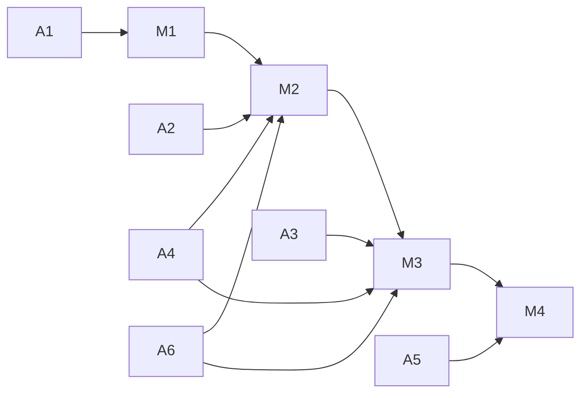

# Deployment Agent Work Packages

本文档用于并行派发多 Agent 执行部署任务，目标是最短路径打通：

- M1: 公网 HTTPS -> 本地 Nginx -> gateway
- M2: gateway -> K8s Service DNS -> domain services
- M3: 全链路稳定可用
- M4: 可观测 + 回滚可操作

## 使用方式

- 每个 Agent 只做一个工作包，避免跨目录冲突。
- 每个工作包都必须给出：改动文件、执行命令、验收结果、风险与回滚。
- 真实 token、证书、密钥禁止提交仓库。

## A1 网络入口组（frps/frpc/nginx）

- **目标**: 打通公网入口链路并稳定运行。
- **主要目录**: `infra/ingress/`
- **输入**:
  - `infra/ingress/frp/frps.toml.example`
  - `infra/ingress/frp/frpc.toml.example`
  - `infra/ingress/nginx/gateway.conf.example`
  - `infra/ingress/README.md`
- **产出**:
  - 可执行的 systemd 服务步骤
  - Nginx TLS 终止与反代配置
  - 健康检查与故障排查清单
- **验收**:
  - `curl -vk https://<domain>/healthz` 返回 gateway 健康
  - `frps`/`frpc`/`nginx` 均为 active

## A2 K8s 基座组（RKE2）

- **目标**: 建立 `simple-living` 命名空间与基础配置。
- **主要目录**: `infra/k8s/base/`
- **输入**:
  - `namespace.yaml`
  - `configmap-common.yaml`
  - `secret-template.yaml`
  - `service-*.yaml`
  - `deployment-*.yaml`
- **产出**:
  - 全服务可 apply 的基础清单
  - 命名、端口、DNS 与仓库约定一致
- **验收**:
  - `kubectl -n simple-living get svc,deploy,pod` 正常
  - `*.simple-living.svc.cluster.local` 可解析

## A3 业务部署组（镜像与编排）

- **目标**: 完成 gateway 与 6 个 domain 的镜像与 Deployment 对接。
- **主要目录**: `infra/k8s/base/`, `services/*/`
- **输入**:
  - `docs/engineering-conventions.md` 端口与目标约定
  - 各服务 `docs/development.md`
- **产出**:
  - 可发布镜像标签约定
  - Deployment 资源请求/限制与探针策略
- **验收**:
  - 滚动升级不中断基础可用性
  - 关键服务重启后自动恢复

## A4 Gateway 联通组（Service DNS 与接口回归）

- **目标**: 确保 gateway 下游调用统一走 K8s Service DNS。
- **主要目录**: `services/gateway/`
- **输入**:
  - `services/gateway/src/gateway_edge_server_main.cpp`
  - `services/gateway/docs/README.md`
  - `services/gateway/docs/development.md`
- **产出**:
  - 下游地址默认值与环境覆盖策略
  - 本地联调覆盖示例（127.0.0.1）
- **验收**:
  - 集群内默认可调用 user/content/recommendation/tracking
  - 本地 flags 覆盖不回归

## A5 可观测与 SRE 组

- **目标**: 打通日志、指标、告警与故障定位路径。
- **主要目录**: `infra/`, `docs/`
- **输入**:
  - `infra/ingress/README.md`
  - `infra/k8s/README.md`
- **产出**:
  - 最小指标面板定义（QPS、P95、5xx、重启次数）
  - 链路异常归因流程文档
- **验收**:
  - 10 分钟内能区分入口、网关、下游或依赖故障

## A6 文档契约组

- **目标**: 保证部署与契约文档一致，避免语义漂移。
- **主要目录**: `docs/`, `services/gateway/docs/`
- **输入**:
  - `docs/contracts/`
  - `docs/architecture/README.md`
  - `docs/engineering-conventions.md`
- **产出**:
  - 契约差异检查清单
  - 变更同步建议（contracts -> gateway docs -> implementation）
- **验收**:
  - 对外 JSON 语义与网关文档一致
  - 内部 proto 映射路径可追溯

## 并行执行依赖图

## 最短路径建议

1. 先并行 A1 + A2 + A4，优先冲 M1 与 M2。
2. M2 达成后，A3 与 A6 并行冲 M3。
3. M3 稳定后，A5 收口 M4 并完成演练脚本。
