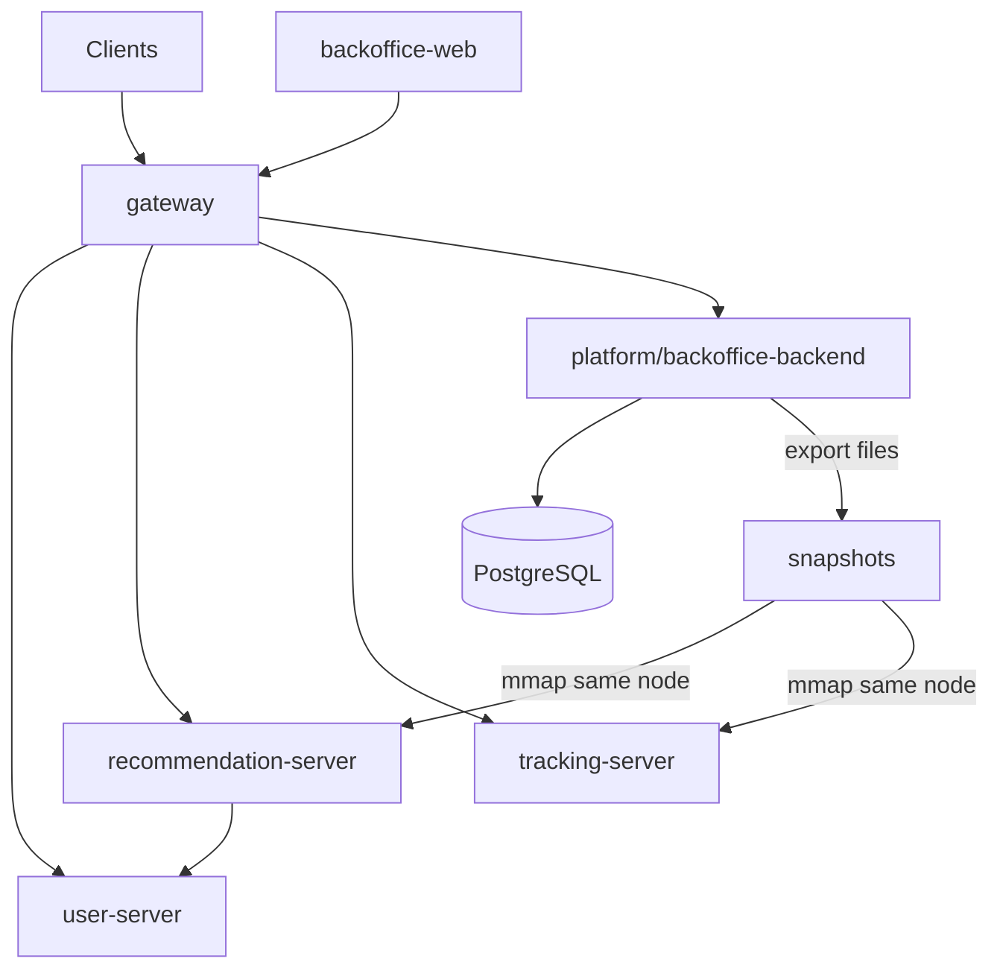

# 业务服务总览

本文件是**跨服务事实中枢**：服务清单与职责、跨服务依赖拓扑与请求链路、跨服务工程约定（Bazel/proto 依赖、端口、持久化、gateway 分层）、测试策略。各服务的实现与交付细节在 `services/<service>/docs/development.md`；跨服务/跨端公共 JSON 契约在 `.cursor/rules/shared-contracts.mdc`。

## 1. 服务划分原则

服务按**稳定业务边界**划分，并按访问特征分离：

- **运营写面（低频）**：`platform/backoffice-backend` 合并内容、治理、联盟配置的权威 OLTP。
- **C 端读面（高频）**：`recommendation-server` 合并导购内容读（snapshot）与推荐编排。
- **用户、跳转、网关** 保持独立。

写读之间通过**同节点 snapshot 导出 + mmap 热加载**同步，不用 C 端 RPC 打运营库。

## 2. 服务清单

### `gateway`

- 统一入口；鉴权、限流、聚合、协议转换
- 唯一公网 BFF，负责对外 HTTPS+JSON 与内部 brpc 的 JSON↔proto 映射；不保存业务权威状态

### `user-server`

- 用户账户、偏好；收藏、历史、反馈；同意与 signal bundle 引用

### `recommendation-server`

- **C 端导购内容读**（mmap `catalog_snapshot` + `visibility_index`）+ **推荐中心**（召回、排序、解释、热门）
- 不直连运营 PostgreSQL；不与 `backoffice-backend` 建立读 RPC

### `tracking-server`

- 面向客户端的 `landing_url` 组装、点击追踪、渠道跳转、归因处理
- 转链规格来自 `backoffice-backend` 导出的 `affiliate_link_spec`（mmap/文件），非 affiliate 独立进程 RPC

### `platform/backoffice-backend`

- 运营后台后端：content + governance + affiliate **写面**权威库
- 产出 snapshot 供 `recommendation-server` 与 `tracking-server` 同节点消费
- 路径：`services/platform/backoffice-backend/`

### `platform/backoffice-web`

- 运营管理后台 Web；经 gateway 访问 backoffice API
- 路径：`services/platform/backoffice-web/`

### `proxy`

- 用户入口流量接入（Nginx / FRP）、TLS 终止与反向代理

### `foundation/postgres` · `foundation/redis` · `foundation/kafka`

- 关系型存储 / 缓存 / 异步消息

## 3. 跨服务依赖与请求链路

### 3.1 依赖拓扑

| 服务 | 直接依赖 | 目的 |
|------|----------|------|
| `gateway` | `user-server`、`recommendation-server`、`tracking-server`、`platform/backoffice-backend` | 路由、聚合、JSON↔proto |
| `user-server` | 无强制运行时依赖 | 自持用户状态 |
| `recommendation-server` | `user-server`；**文件** snapshot | 信号 + 导购读/推荐 |
| `tracking-server` | **文件** `affiliate_link_spec` | 转链规格 |
| `platform/backoffice-backend` | PostgreSQL；可选 Kafka | 运营写 + 导出 |

### 3.2 典型请求链路

- **首页推荐（读）**：Client → gateway → user-server(可选) → recommendation-server（snapshot 内候选 + 排序）→ gateway。
- **导购详情（读）**：Client → gateway → recommendation-server.BatchGetGuideCards → gateway。
- **跳转准备**：Client → gateway → tracking-server（读 affiliate_link_spec snapshot + 本地签名密钥）→ gateway。
- **内容发布（运营写）**：backoffice-web → gateway → backoffice-backend（进程内 content→governance→发布）→ 导出 snapshot → recommendation-server 热切换。

### 3.3 改动影响范围

| 改动类型 | 必看 |
|----------|------|
| 对外 JSON / 页面聚合 | `gateway` + 相关服务 + 共享契约规则 |
| 导购卡片/可见性/披露（C 端） | `recommendation-server` + `platform/backoffice-backend` 导出 + `gateway` |
| 运营写/审核/伙伴配置 | `platform/backoffice-backend` + `gateway` backoffice 路由 + `backoffice-web` |
| 推荐策略/解释 | `recommendation-server` + `gateway` |
| 转链/归因 | `tracking-server` + `gateway` + backoffice 导出 |
| 用户态 | `user-server` + `gateway` + `recommendation-server` |

## 4. 跨服务工程约定

### 4.1 Bazel 与 proto 依赖

| 消费方 | 可依赖的提供方 |
|--------|----------------|
| `gateway` | 各 `*-server` / `backoffice-backend` 已导出 RPC proto；导购数据模型与 `ContentService` 读 RPC 见 `//common/proto` |
| `recommendation-server` | `user-server`；`//common/proto:catalog_cc_proto`、`content_service_cc_proto`（snapshot + 读 RPC 实现） |
| `tracking-server` | `//common/proto:catalog_cc_proto`（解析 snapshot JSON）；无其他业务域 proto |
| `platform/backoffice-backend` | `//common/proto`（写面实现 `ContentService`）；本服务自有 governance/affiliate proto |

**禁止**拷贝/fork 他服务 `.proto`；**禁止** C 端服务 include 他服务 `src/` 私有头文件。

### 4.2 端口与本地联调

| 服务 | 默认端口 | 协议 | Bazel 二进制目标 |
|------|----------|------|------------------|
| `gateway` | `8080` | HTTPS+JSON | `//services/gateway:gateway_edge_server` |
| `user-server` | `9101` | brpc | `//services/user-server:user_server` |
| `recommendation-server` | `9103` | brpc | `//services/recommendation-server:recommendation_server` |
| `tracking-server` | `9105` | brpc | `//services/tracking-server:tracking_server` |
| `platform/backoffice-backend` | `9110` | brpc | `//services/platform/backoffice-backend:backoffice_backend_server` |

gateway 下游 flags（v1 目标）：

- `-user_server_addr`
- `-recommendation_server_addr`
- `-tracking_server_addr`
- `-backoffice_backend_addr`

**同节点**：`backoffice-backend` 与 `recommendation-server` 共享 `-export_dir`/`-snapshot_dir`（默认 `/var/lib/simple-living/exports`）。

最小联调启动顺序：foundation → `backoffice-backend` → `recommendation-server` → `user-server` → `tracking-server` → `gateway`。

### 4.3 持久化与缓存

| 组件 | 约定 |
|------|------|
| PostgreSQL | **backoffice-backend** 权威（三 schema）；user-server/tracking-server 各自库表 |
| Redis | 会话、限流、tracking-server 热 token |
| Kafka | 异步事件、outbox |
| 文件 snapshot | C 端导购读权威（派生于 backoffice） |

### 4.4 gateway 协议分层

终端 → Nginx → gateway（HTTPS+JSON）→ 业务服务 brpc + proto。详见各服务 `development.md`。

## 5. 测试策略

各服务至少一条核心 RPC happy path；`gateway` 至少一条 HTTP 成功 + 典型错误码。`recommendation-server` 集成测试须含 fixture snapshot 热加载。

## 6. 目录结构

**C++ 业务服务**（`gateway`、`*-server`、`platform/backoffice-backend`）须具备 `docs/`、`proto/`、`src/`、`tests/`、`deploy/`、`BUILD.bazel`。

**例外**：

| 路径 | 说明 |
|------|------|
| `platform/backoffice-web` | 前端 SPA（npm/Vite），无 `BUILD.bazel`/`proto/`；文档在 `docs/`，部署在 `deploy/` |
| `foundation/*`、`proxy` | 基础设施/入口模板，无完整 `src/` 服务二进制 |
| `platform/backoffice-backend`、`proxy`、`backoffice-web` | v1 **无** `deploy/k8s/`；集群基座见 `environments/kubernetes/`，业务 Deployment 待补或仅用 QEMU |

`platform/` 组说明见 `services/platform/README.md`。

## 7–9. 文档与交付

实现与交付：各服务 `docs/development.md`；公共 JSON：`.cursor/rules/shared-contracts.mdc`。
