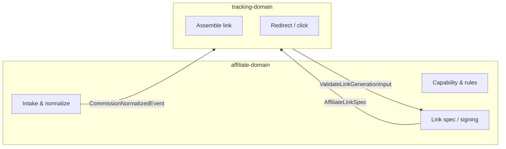

# Affiliate domain — internal API (`proto` / RPC)

This document is the **delivery-ready** contract for `affiliate-domain` internal services. Field names use **`snake_case`** to align with shared JSON semantics where concepts overlap (`landing_url` is produced by **tracking-domain** using specs from this domain; see integration §7).

**Orientation**

- **Owns**: partner capability abstraction, commission rule versions, **validated link-generation inputs → partner-specific URL/signature/token specs**, partner callback and raw report intake rules, normalized commission **event** shapes emitted to downstream consumers.
- **Does not own**: browser redirects, short-link HTTP serving, click persistence, or attribution stitching (**tracking-domain**).

**Versioning**

- RPC package: `simple_living.affiliate_domain`.
- Source of truth for machine-readable definitions: `services/affiliate-domain/proto/affiliate_domain.proto`.
- Breaking changes → new package minor/major per team policy; document in [changelog.md](./changelog.md).

---

## 1. Services and RPCs

### 1.1 `AffiliatePartnerService`

| RPC | Request | Response | Idempotency |
|-----|---------|----------|-------------|
| `GetPartnerCapabilitySnapshot` | `GetPartnerCapabilitySnapshotRequest` | `GetPartnerCapabilitySnapshotResponse` | Read; cacheable |
| `ValidateLinkGenerationInput` | `ValidateLinkGenerationInputRequest` | `ValidateLinkGenerationInputResponse` | Safe retry; same input → same spec within partner TTL rules |

### 1.2 `AffiliateCommissionRuleService`

| RPC | Request | Response | Idempotency |
|-----|---------|----------|-------------|
| `CreateCommissionRuleSetVersion` | `CreateCommissionRuleSetVersionRequest` | `CreateCommissionRuleSetVersionResponse` | Client `idempotency_key` dedupes duplicate admin submits |
| `GetCommissionRuleSet` | `GetCommissionRuleSetRequest` | `GetCommissionRuleSetResponse` | Read |

### 1.3 `AffiliateIntakeService`

| RPC | Request | Response | Idempotency |
|-----|---------|----------|-------------|
| `IngestPartnerWebhook` | `IngestPartnerWebhookRequest` | `IngestPartnerWebhookResponse` | `(partner_id, partner_event_id)` unique |
| `RegisterReportBatch` | `RegisterReportBatchRequest` | `RegisterReportBatchResponse` | `(partner_id, batch_checksum)` dedupe |

---

## 2. Enums

### 2.1 `PartnerLifecycleStatus`

| Value | Meaning |
|-------|---------|
| `PARTNER_LIFECYCLE_STATUS_UNSPECIFIED` | Invalid; reject |
| `PARTNER_LIFECYCLE_STATUS_DRAFT` | Not eligible for production links |
| `PARTNER_LIFECYCLE_STATUS_ACTIVE` | Normal operation |
| `PARTNER_LIFECYCLE_STATUS_SUNSET` | Deprecating; policy-defined grace |
| `PARTNER_LIFECYCLE_STATUS_DISABLED` | Hard off |

### 2.2 `ReportingChannel`

| Value | Meaning |
|-------|---------|
| `REPORTING_CHANNEL_UNSPECIFIED` | |
| `REPORTING_CHANNEL_API` | Pull API |
| `REPORTING_CHANNEL_WEBHOOK` | Partner push |
| `REPORTING_CHANNEL_SFTP` | File drop |
| `REPORTING_CHANNEL_MANUAL_UPLOAD` | Ops upload |

### 2.3 `CapabilityFlag` (repeated on snapshot)

Normalized booleans (extend in minor versions). Examples:

| Value | Meaning |
|-------|---------|
| `CAPABILITY_FLAG_DEEP_LINK` | Deep link / app link supported |
| `CAPABILITY_FLAG_COUPON_CODE` | Coupon parameter supported |
| `CAPABILITY_FLAG_SUB_ID_SLOTS` | Sub-id slots available |
| `CAPABILITY_FLAG_DAILY_ORDER_REPORT` | Reporting granularity |

### 2.4 `LinkParamBindingKind`

| Value | Meaning |
|-------|---------|
| `LINK_PARAM_BINDING_KIND_UNSPECIFIED` | |
| `LINK_PARAM_BINDING_KIND_LITERAL` | Fixed string |
| `LINK_PARAM_BINDING_KIND_TEMPLATE` | Template with placeholders |
| `LINK_PARAM_BINDING_KIND_REF_TOKEN` | Resolved via `token_handle` at apply time |

### 2.5 `CommissionEventStatus`

| Value | Meaning |
|-------|---------|
| `COMMISSION_EVENT_STATUS_UNSPECIFIED` | |
| `COMMISSION_EVENT_STATUS_PENDING` | Awaiting confirmation |
| `COMMISSION_EVENT_STATUS_CONFIRMED` | Settled per partner |
| `COMMISSION_EVENT_STATUS_REVERSED` | Chargeback / reversal |
| `COMMISSION_EVENT_STATUS_INVALID` | Rejected after ingest |

### 2.6 `AffiliateErrorCode` (application errors)

Transport: map to `google.rpc.Status` with `details` carrying `ErrorInfo` / custom `AffiliateErrorDetail` if needed.

| Code | gRPC | When |
|------|------|------|
| `AFFILIATE_ERROR_CODE_UNSPECIFIED` | `INTERNAL` | Unexpected |
| `AFFILIATE_ERROR_CODE_PARTNER_NOT_FOUND` | `NOT_FOUND` | Unknown `partner_id` |
| `AFFILIATE_ERROR_CODE_PARTNER_DISABLED` | `FAILED_PRECONDITION` | Lifecycle not `ACTIVE` |
| `AFFILIATE_ERROR_CODE_VALIDATION_FAILED` | `INVALID_ARGUMENT` | Link input breaks capability or policy |
| `AFFILIATE_ERROR_CODE_SUB_ID_VIOLATION` | `INVALID_ARGUMENT` | Sub-id slot/charset violation |
| `AFFILIATE_ERROR_CODE_TOKEN_UNAVAILABLE` | `FAILED_PRECONDITION` | Partner token/signature acquisition failed |
| `AFFILIATE_ERROR_CODE_WEBHOOK_SIGNATURE_INVALID` | `UNAUTHENTICATED` | HMAC/signature verification failed |
| `AFFILIATE_ERROR_CODE_DUPLICATE_INGEST` | `ALREADY_EXISTS` | Same partner natural key |
| `AFFILIATE_ERROR_CODE_RULE_VERSION_CONFLICT` | `ABORTED` | Effective window overlap |

---

## 3. Messages (request / response and nested types)

### 3.1 `GetPartnerCapabilitySnapshotRequest`

| Field | Type | Required | Description |
|-------|------|----------|-------------|
| `partner_id` | `string` | yes | Internal stable id |
| `environment` | `string` | no | Logical deploy env for staged rollouts (`prod`, `staging`, …) |

### 3.2 `GetPartnerCapabilitySnapshotResponse`

| Field | Type | Description |
|-------|------|-------------|
| `snapshot` | `PartnerCapabilitySnapshot` | Current effective snapshot |

### 3.3 `PartnerCapabilitySnapshot`

| Field | Type | Description |
|-------|------|-------------|
| `partner_id` | `string` | |
| `capability_set_id` | `string` | Version id of this snapshot |
| `lifecycle_status` | `PartnerLifecycleStatus` | |
| `flags` | `repeated CapabilityFlag` | Normalized abilities |
| `link_constraints` | `LinkConstraints` | Lengths, charset, required keys |
| `reporting` | `ReportingProfile` | Channels, SLA hints (business-level) |

### 3.4 `LinkConstraints`

| Field | Type | Description |
|-------|------|-------------|
| `max_url_length` | `int32` | |
| `allowed_query_key_regex` | `string` | Optional pattern |
| `required_query_keys` | `repeated string` | Partner-native names |
| `forbidden_query_combinations` | `repeated string` | Opaque policy codes |

### 3.5 `ReportingProfile`

| Field | Type | Description |
|-------|------|-------------|
| `channels` | `repeated ReportingChannel` | |
| `expected_latency_hours` | `int32` | Business expectation |
| `freshness_notes` | `string` | Human-readable SLA context |

### 3.6 `ValidateLinkGenerationInputRequest`

| Field | Type | Required | Description |
|-------|------|----------|-------------|
| `input` | `LinkGenerationInput` | yes | Intent to validate |
| `idempotency_key` | `string` | recommended | Caller correlation |

### 3.7 `LinkGenerationInput`

| Field | Type | Required | Description |
|-------|------|----------|-------------|
| `input_id` | `string` | no | Audit correlation |
| `partner_id` | `string` | yes | |
| `campaign_ref` | `string` | no | Opaque campaign handle |
| `product_refs` | `repeated string` | no | Partner-mapped offer/SKU ids |
| `sub_ids` | `map<string, string>` | no | Normalized slot → value |
| `placement` | `string` | no | Surface key for policy (e.g. `feed`) |
| `compliance_context` | `ComplianceContext` | no | Geo, disclosure mode flags |

**Cross-domain mapping rule (v1):**

- `campaign_ref` is copied 1:1 into tracking-side `AttributionPayload.campaign_slot`; v1 does not introduce an additional translation table.
- `sub_ids` use normalized slot names `sub_id_1`, `sub_id_2`, `sub_id_3`; these keys map directly to tracking-side `AttributionPayload.sub_id_1..3`. Keys beyond the first three may remain inside affiliate internals but are **not guaranteed** to enter the tracking v1 attribution snapshot.

### 3.8 `ComplianceContext`

| Field | Type | Description |
|-------|------|-------------|
| `region_code` | `string` | ISO-like region |
| `disclosure_mode` | `string` | Policy enum as string for extensibility |
| `restricted_category_flags` | `repeated string` | Blocklist hints |

### 3.9 `ValidateLinkGenerationInputResponse`

| Field | Type | Description |
|-------|------|-------------|
| `spec` | `AffiliateLinkSpec` | Present on success |
| `validation_issues` | `repeated ValidationIssue` | Present on failure |

### 3.10 `ValidationIssue`

| Field | Type | Description |
|-------|------|-------------|
| `code` | `string` | Stable machine code |
| `field_path` | `string` | Proto/JSON path style |
| `message` | `string` | Human-readable |

### 3.11 `AffiliateLinkSpec`

**Note:** This is **not** the client `landing_url`. It is the **partner-specific build recipe** that **tracking-domain** applies when assembling or resolving redirects.

| Field | Type | Description |
|-------|------|-------------|
| `spec_id` | `string` | Unique generation id |
| `partner_id` | `string` | |
| `expires_at` | `google.protobuf.Timestamp` | Business validity |
| `target_base` | `string` | Base URL or deep-link template |
| `query_params` | `repeated QueryParamBinding` | Ordered parameters |
| `signature_spec` | `SignatureSpec` | Optional signing rules |
| `token_handles` | `repeated TokenHandle` | Opaque refs for short-lived partner tokens |

### 3.12 `QueryParamBinding`

| Field | Type | Description |
|-------|------|-------------|
| `name` | `string` | Partner-native query key |
| `kind` | `LinkParamBindingKind` | |
| `literal_value` | `string` | When `LITERAL` |
| `template_value` | `string` | When `TEMPLATE` |
| `token_handle` | `string` | When `REF_TOKEN` |

`template_value` represents a **placeholder expression to be filled by the caller**. In v1 the allowed placeholder set is `{channel_code}`, `{campaign_slot}`, `{sub_id_1}`, `{sub_id_2}`, `{sub_id_3}`. Placeholder resolution is owned by **tracking-domain** and must happen before signature calculation.

### 3.13 `SignatureSpec`

| Field | Type | Description |
|-------|------|-------------|
| `algorithm` | `string` | e.g. `HMAC_SHA256` |
| `signed_param_names` | `repeated string` | Inclusion order matters |
| `key_version` | `string` | For rotation |

### 3.14 `TokenHandle`

| Field | Type | Description |
|-------|------|-------------|
| `handle_id` | `string` | Reference resolved by affiliate adapters |
| `refresh_before` | `google.protobuf.Timestamp` | Hint for proactive refresh |

`TokenHandle` / `REF_TOKEN` belong to **affiliate-domain adapter-private capability**. v1 exposes **no** additional public RPC for "handle -> token value" resolution. If redirect-time refresh of a short-lived token is needed, the implementation may either call `ValidateLinkGenerationInput` again using the same `LinkGenerationInput` to obtain a fresh `AffiliateLinkSpec`, or refresh inside affiliate private adapters; neither path creates a new cross-domain public contract.

At the cross-service contract level, tracking must not depend on any undocumented extra interface beyond `ValidateLinkGenerationInput`. If a successful validation result still cannot be materialized into a final outbound URL because `REF_TOKEN` remains unresolved after the allowed revalidation path, that is treated as an affiliate spec/runtime failure rather than a missing caller responsibility.

### 3.15 `CreateCommissionRuleSetVersionRequest`

| Field | Type | Required | Description |
|-------|------|----------|-------------|
| `partner_id` | `string` | yes | |
| `effective_from` | `google.protobuf.Timestamp` | yes | |
| `effective_to` | `google.protobuf.Timestamp` | no | Open-ended if unset |
| `source_reference` | `string` | yes | Ticket / doc id |
| `rule_payload` | `bytes` | yes | Opaque structured rules (versioned schema) |
| `idempotency_key` | `string` | yes | Admin submit dedupe |

### 3.16 `CreateCommissionRuleSetVersionResponse`

| Field | Type | Description |
|-------|------|-------------|
| `rule_set_id` | `string` | New immutable version id |
| `version` | `int32` | Monotonic per partner |

### 3.17 `GetCommissionRuleSetRequest`

| Field | Type | Required | Description |
|-------|------|----------|-------------|
| `partner_id` | `string` | yes | |
| `as_of` | `google.protobuf.Timestamp` | no | Defaults to now |

### 3.18 `GetCommissionRuleSetResponse`

| Field | Type | Description |
|-------|------|-------------|
| `rule_set_id` | `string` | |
| `version` | `int32` | |
| `effective_from` | `google.protobuf.Timestamp` | |
| `effective_to` | `google.protobuf.Timestamp` | |
| `rule_payload` | `bytes` | Opaque |

### 3.19 `IngestPartnerWebhookRequest`

| Field | Type | Required | Description |
|-------|------|----------|-------------|
| `partner_id` | `string` | yes | |
| `partner_event_id` | `string` | yes | Partner-asserted id for idempotency |
| `headers_fingerprint` | `string` | no | For audit |
| `raw_body` | `bytes` | yes | Unparsed body for signature verification |
| `received_at` | `google.protobuf.Timestamp` | yes | Edge receive time |

### 3.20 `IngestPartnerWebhookResponse`

| Field | Type | Description |
|-------|------|-------------|
| `accepted` | `bool` | |
| `normalized_event` | `CommissionNormalizedEvent` | Emitted or staged when accepted; duplicate replay MAY leave this field unset |

### 3.21 `RegisterReportBatchRequest`

| Field | Type | Required | Description |
|-------|------|----------|-------------|
| `partner_id` | `string` | yes | |
| `channel` | `ReportingChannel` | yes | |
| `batch_checksum` | `string` | yes | Dedup |
| `payload_ref` | `string` | yes | Object storage pointer |
| `row_count_estimate` | `int32` | no | |

### 3.22 `RegisterReportBatchResponse`

| Field | Type | Description |
|-------|------|-------------|
| `batch_id` | `string` | Internal batch id |
| `duplicate` | `bool` | True if checksum already registered |

---

## 4. Outbound async contract: `CommissionNormalizedEvent`

Published to the event bus / stream consumed by **tracking-domain** (correlation), finance analytics, and ops. Not a unary RPC. The payload shape on the wire is the provider-owned `CommissionNormalizedEvent` message itself; topic / queue names, DLQ policy, and deployment-specific transport bindings are operational configuration rather than public contract.

| Field | Type | Description |
|-------|------|-------------|
| `event_id` | `string` | Globally unique; deterministic where possible |
| `partner_id` | `string` | |
| `occurred_at` | `google.protobuf.Timestamp` | Partner-asserted or inferred |
| `amount_minor` | `int64` | Optional |
| `currency` | `string` | ISO 4217 |
| `status` | `CommissionEventStatus` | |
| `correlation_hints` | `CorrelationHints` | Opaque passthrough from tracking-originated ids |

### 4.1 `CorrelationHints`

| Field | Type | Description |
|-------|------|-------------|
| `click_id` | `string` | If known from partner payload |
| `sub_ids` | `map<string, string>` | Echo of tracking/affiliate sub slots |
| `external_order_id` | `string` | If present |

**Rule:** Affiliate-domain **stores and forwards** correlation hints; it does **not** own click lifecycle or redirect truth.

For downstream tracking ingest in v1, `sub_ids["sub_id_1"]..["sub_id_3"]` are the only promoted slots.

---

## 5. Error payload shape

All RPC failures SHOULD populate:

- `google.rpc.Status.code` — canonical gRPC code
- `google.rpc.Status.message` — safe summary
- `AffiliateErrorDetail` (optional `Any` detail):

| Field | Type | Description |
|-------|------|-------------|
| `code` | `AffiliateErrorCode` | |
| `partner_id` | `string` | When relevant |
| `retryable` | `bool` | Caller backoff hint |

---

## 6. Idempotency and ordering

| Situation | Behavior |
|-----------|----------|
| Duplicate webhook with same `partner_event_id` | Second call returns success (`accepted = true`); `normalized_event` MAY be omitted and MUST NOT trigger a second downstream publish |
| Partial report file | No `confirmed` commission status until business completeness rules pass |
| Invalid webhook signature | `UNAUTHENTICATED`; no side effects |

---

## 7. Integration notes

### 7.1 With **tracking-domain**

- `tracking-domain.AssembleTrackingLinkRequest.affiliate_context_ref` is issued by an affiliate-owned provisioning / publish pipeline and attached upstream as an opaque pass-through value; gateway and content producers must not construct or mutate it. At runtime it must be expandable into one canonical `LinkGenerationInput` with exactly these semantic fields: `partner_id`, `campaign_ref`, `product_refs`, `sub_ids`, `placement`, `compliance_context`.
- Tracking is not required to understand the byte-level encoding of `affiliate_context_ref`; the encoding stays affiliate-owned. The interoperable contract is the expanded semantic `LinkGenerationInput`, obtained through the affiliate-owned resolver/helper path paired with provisioning.
- In the monorepo v1 implementation model, that resolver/helper is an affiliate-owned implementation module (library / package), not a separate public RPC. Tracking integrations must reuse the co-versioned helper instead of inventing another network contract.
- **tracking-domain** calls `ValidateLinkGenerationInput` (or consumes cached **equivalent** spec) when assembling a user-facing link; it embeds **non-secret** attribution in signed tokens per tracking docs.
- **tracking-domain** owns `landing_url` construction for the client; affiliate-domain supplies **`AffiliateLinkSpec`** (partner URL, query bindings, signing/token handles).
- If `affiliate_context_ref` expands with an embedded `placement`, it must match `tracking-domain.AssembleTrackingLinkRequest.placement`; mismatch should be treated as invalid context rather than silently overridden.
- v1 has no extra public RPC for redirect-time token refresh or signature recalculation; if refresh is needed, tracking must reuse the same `affiliate_context_ref -> LinkGenerationInput -> ValidateLinkGenerationInput` path, or rely on affiliate private adapter capability, and must not assume an undocumented new RPC exists.
- `LinkGenerationInput.campaign_ref` maps to tracking `AttributionPayload.campaign_slot`, and `sub_ids["sub_id_1".."sub_id_3"]` map to tracking `AttributionPayload.sub_id_1..3`.
- `CommissionNormalizedEvent` maps to tracking as follows in v1: `event_id -> IngestConversion.external_event_id`, `partner_id -> attribution.channel_code` (unless an explicit alias mapping is documented upstream), `occurred_at -> occurred_at`, `correlation_hints.click_id -> click_id`, `amount_minor/currency -> commission.value_minor/currency`, `source = CONVERSION_SOURCE_AFFILIATE_DOMAIN`, `conversion_type = CONVERSION_TYPE_ORDER_PAID`. `amount` may be empty when gross order amount is unavailable.
- `CommissionEventStatus.PENDING` / `CONFIRMED` may enter tracking conversion views. `REVERSED` / `INVALID` do not map to new positive facts in v1 `IngestConversion`; they must flow into later reversal / adjustment handling owned by affiliate or ops workflows.
- For `PENDING` vs `CONFIRMED`, tracking v1 carries the distinction through `CommissionMinor.estimate` (`true` for `PENDING`, `false` for `CONFIRMED`).
- The handoff is asynchronous in v1: affiliate publishes `CommissionNormalizedEvent`, and a tracking-owned consumer/relay is responsible for invoking `IngestConversion`. There is no requirement for synchronous affiliate -> tracking gRPC on the webhook path.
- For `campaign_slot`, affiliate does not emit an extra event field in v1. Tracking recovers it from its persisted link/click attribution snapshot via `click_id`; if no `click_id` can be resolved, `campaign_slot` remains empty rather than being reconstructed heuristically.
- For `sub_id_1..3`, tracking should prefer the persisted click/link attribution snapshot when `click_id` resolves successfully; `correlation_hints.sub_ids` are fallback or consistency-check inputs. On conflict, the persisted tracking snapshot wins and the incoming event should be flagged for audit rather than rejected.
- For `REVERSED` / `INVALID`, the tracking consumer must not emit a new positive `IngestConversion` fact; it should route the event into the adjustment / reversal workflow owned outside this v1 RPC contract, while retaining audit traceability to the original affiliate `event_id`.
- Reversal / adjustment handling is explicitly out of scope for the v1 positive-conversion path documented here; teams implementing the main affiliate -> tracking relay must not invent an extra synchronous RPC for it inside this task.

### 7.2 With **gateway**

- Gateway maps public JSON ↔ internal proto; shared external names remain `landing_url`, `click_id`, etc., per `docs/contracts/`.

### 7.3 Partner adapters

OAuth, product sync, report pull, and partner-specific URL builders live behind **affiliate-domain** service boundaries; other domains must not fork partner `proto`.

---

## 8. Diagram (context)



## Appendix A. Request / response examples

The examples below use **proto-text** to mirror internal message structure more directly. Actual wire transport remains `proto2 + gRPC`; enum values are shown by symbolic name and `Timestamp` values are illustrated in message form.

### A.1 `ValidateLinkGenerationInput`

#### Request (`textproto`)

```textproto
input {
  input_id: "input_01HSZ29Y3R2M6F8Q1T4N"
  partner_id: "pdd"
  campaign_ref: "campaign_spring_2026"
  product_refs: "893245001"
  sub_ids {
    key: "sub_id_1"
    value: "guide_card_1001"
  }
  sub_ids {
    key: "sub_id_2"
    value: "rec_01HSZ15H0N8HG9P5P2E0"
  }
  placement: "feed"
  compliance_context {
    region_code: "CN"
    disclosure_mode: "affiliate_required"
  }
}
idempotency_key: "linkgen_01HSZ2BC3T0R8S1M5J9Q"
```

#### Response (`textproto`)

```textproto
spec {
  spec_id: "affspec_01HSZ2D1CGQ7WY1FWK2T"
  partner_id: "pdd"
  expires_at {
    seconds: 1774699800
  }
  target_base: "https://mobile.yangkeduo.com/goods.html"
  query_params {
    name: "goods_id"
    kind: LINK_PARAM_BINDING_KIND_LITERAL
    literal_value: "893245001"
  }
  query_params {
    name: "pid"
    kind: LINK_PARAM_BINDING_KIND_TEMPLATE
    template_value: "{channel_code}"
  }
  query_params {
    name: "custom_parameters"
    kind: LINK_PARAM_BINDING_KIND_REF_TOKEN
    token_handle: "token_handle_subid_01"
  }
  signature_spec {
    algorithm: "HMAC_SHA256"
    signed_param_names: "goods_id"
    signed_param_names: "pid"
    signed_param_names: "custom_parameters"
    key_version: "v3"
  }
  token_handles {
    handle_id: "token_handle_subid_01"
    refresh_before {
      seconds: 1774698900
    }
  }
}
```

### A.2 `IngestPartnerWebhook`

#### Request (`textproto`)

```textproto
partner_id: "pdd"
partner_event_id: "order_99887766_status_paid"
headers_fingerprint: "sha256:6a5f2cc0d9..."
raw_body: "<bytes>"
received_at {
  seconds: 1774699275
}
```

#### Response (`textproto`)

```textproto
accepted: true
normalized_event {
  event_id: "cnevt_01HSZ2KFC8AJR0W3N8VA"
  partner_id: "pdd"
  occurred_at {
    seconds: 1774699248
  }
  amount_minor: 1280
  currency: "CNY"
  status: COMMISSION_EVENT_STATUS_CONFIRMED
  correlation_hints {
    click_id: "click_01HSZ1WJ2M4Q8X7ZB0H9"
    sub_ids {
      key: "sub_id_1"
      value: "guide_card_1001"
    }
    sub_ids {
      key: "sub_id_2"
      value: "rec_01HSZ15H0N8HG9P5P2E0"
    }
    external_order_id: "order_99887766"
  }
}
```

### A.3 `GetPartnerCapabilitySnapshot`

#### Request (`textproto`)

```textproto
partner_id: "pdd"
environment: "prod"
```

#### Response (`textproto`)

```textproto
snapshot {
  partner_id: "pdd"
  capability_set_id: "capset_01HSZB2M5Q7N4T8V1K3P"
  lifecycle_status: PARTNER_LIFECYCLE_STATUS_ACTIVE
  flags: CAPABILITY_FLAG_DEEP_LINK
}
```

### A.4 `CreateCommissionRuleSetVersion`

#### Request (`textproto`)

```textproto
partner_id: "pdd"
effective_from {
  seconds: 1774698000
}
source_reference: "ops_ticket_9241"
rule_payload: "<bytes>"
idempotency_key: "rule_01HSZB6V2M4P8Q1N7R3K"
```

#### Response (`textproto`)

```textproto
rule_set_id: "rule_set_01HSZB8A6P5Q9N2M4T1V"
version: 3
```

### A.5 `GetCommissionRuleSet`

#### Request (`textproto`)

```textproto
partner_id: "pdd"
as_of {
  seconds: 1774699800
}
```

#### Response (`textproto`)

```textproto
rule_set_id: "rule_set_01HSZB8A6P5Q9N2M4T1V"
version: 3
effective_from {
  seconds: 1774698000
}
rule_payload: "<bytes>"
```

### A.6 `RegisterReportBatch`

#### Request (`textproto`)

```textproto
partner_id: "pdd"
channel: REPORTING_CHANNEL_API
batch_checksum: "sha256:ab12cd34"
payload_ref: "s3://affiliate-reports/pdd/2026-03-28.csv"
row_count_estimate: 128
```

#### Response (`textproto`)

```textproto
batch_id: "report_batch_01HSZBCM7Q4P1N8M6V2K"
duplicate: false
```
