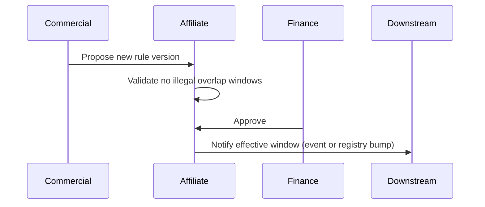

# Affiliate domain — workflows

Business-level lifecycles for **parallel development**. Steps are **logical**; assignment to services or jobs is implementation.

## 1. Onboard a new partner

| Phase | Owner (domain) | Outcome |
|-------|----------------|---------|
| 1. Commercial agreement | Business / legal | Signed terms (outside system). |
| 2. Integration charter | affiliate-domain | Partner record in `draft`; platform_kind set. |
| 3. Capability discovery | affiliate-domain | PartnerCapabilitySet v1 documented and published to consumers. |
| 4. Link contract | affiliate-domain + tracking-domain | Agreed shape for LinkGenerationInput and AffiliateLinkSpec; tracking validates redirects against capability matrix. |
| 5. Intake design | affiliate-domain | Raw report or webhook schema, dedupe keys, mapping doc. |
| 6. Commission rules v1 | affiliate-domain | CommissionRuleSet approved with effective date. |
| 7. Go-live | affiliate-domain | Status `active`; monitoring on intake error rate and spec validation failures. |

**Exit criteria**: Capabilities published, first successful **dry-run** normalization in sandbox, signed-off link policy template.

## 2. Publish or change commission rules

**Rules**:

- No silent retroactive changes: `effective_from` must be **now or future** unless explicit break-glass procedure exists (documented outside this file).
- Reprocessing of historical raw batches **may** be triggered manually; automatic replay policy is a business decision.

## 3. Generate affiliate link (cross-domain)

| Step | Domain | Action |
|------|--------|--------|
| A | tracking-domain / product | User or system requests redirect for a campaign. |
| B | affiliate-domain | Build LinkGenerationInput; validate against PartnerCapabilitySet + Link policy template. |
| C | affiliate-domain | Produce final partner URL or short-lived signed AffiliateLinkSpec (including tokens/signatures if required). |
| D | tracking-domain | Record click, execute controlled redirect, and consume affiliate outputs without重写 partner-specific signing logic. |

**Failure at B or C**: Return structured errors to caller; **no redirect** should occur with invalid affiliate intent.

默认原则：

- **partner-specific URL 拼装、签名、令牌刷新逻辑由 affiliate-domain 负责**
- `tracking-domain` 负责点击、跳转状态机与归因，不重新实现各联盟平台的签名规则

## 4. Ingest partner report or callback

| Step | Action |
|------|--------|
| 1 | Receive raw payload → store RawPartnerReportBatch with checksum. |
| 2 | Verify authenticity (signature, IP allowlist, or API auth—partner-specific). |
| 3 | Parse and map rows to normalized columns. |
| 4 | Deduplicate using partner natural keys + batch rules. |
| 5 | Apply CommissionRuleSet for the row’s timestamp (version selection). |
| 6 | Emit NormalizedCommissionEvent(s) with correct `status`. |
| 7 | Surface exceptions to reconciliation queue if mapping or validation fails. |

## 5. Reconcile commissions with internal expectations

| Step | Owner | Note |
|------|-------|------|
| Compare normalized totals to internal forecasts | Finance / ops | Uses events from affiliate-domain, not raw clicks only. |
| Investigate gaps | ops | May request **tracking-domain** exports using `correlation` fields. |
| Partner dispute | partnerships | affiliate-domain supplies batch id, mapping version, and sample rows. |

## 6. Sunset or disable a partner

| Step | Action |
|------|--------|
| 1 | Set lifecycle to `sunset`; block **new** LinkGenerationInput for that partner unless break-glass. |
| 2 | Keep intake active for lagging reports per contractual tail period. |
| 3 | Archive capability and rule versions as read-only. |
| 4 | Coordinate with tracking-domain to stop issuing new redirects or show deprecation messaging (product decision). |

## 7. Incident categories (for runbooks elsewhere)

| Category | Primary signal |
|----------|----------------|
| Partner API outage | Link spec or token acquisition failure rate. |
| Bad mapping | Spike in reconciliation queue volume. |
| Auth / signature failure | Webhook or API 401/403 with partner correlation id. |
| Rule misconfiguration | Confirmed commissions inconsistent with published rule version. |
