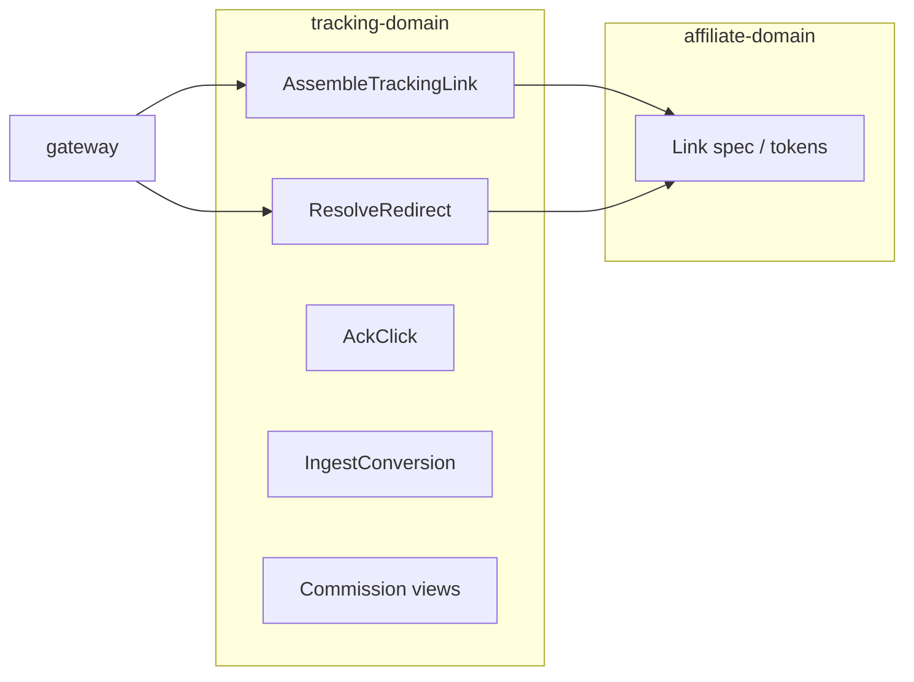

# Tracking domain — internal API (`proto` / RPC)

This document is the **delivery-ready** contract for `tracking-domain` internal services. **`gateway`** maps public HTTPS + JSON to these RPCs; shared external semantics use **`snake_case`** and names such as `landing_url`, `click_id`, `guide_card_id`, `recommendation_id`, `scene` per `docs/contracts/`.

**Orientation**

- **Owns**: click recording, controlled redirect / short-token resolution, attribution snapshots, conversion ingest, commission **read views** (dashboards—not legal settlement).
- **Does not own**: partner-specific URL grammar, signing algorithms, or partner API credentials (**affiliate-domain**).

**Versioning**

- RPC package: `simple_living.tracking_domain`.
- Source of truth for machine-readable definitions: `services/tracking-domain/proto/tracking_domain.proto`.
- Breaking changes → new package version; record in [changelog.md](./changelog.md).

---

## 1. Services and RPCs

### 1.1 `TrackingLinkService`

| RPC | Request | Response | Idempotency |
|-----|---------|----------|-------------|
| `AssembleTrackingLink` | `AssembleTrackingLinkRequest` | `AssembleTrackingLinkResponse` | Same `idempotency_key` → same `link_ref` within TTL |

### 1.2 `TrackingRedirectService`

| RPC | Request | Response | Idempotency |
|-----|---------|----------|-------------|
| `ResolveRedirect` | `ResolveRedirectRequest` | `ResolveRedirectResponse` | Click: at most one primary fact per policy key (see §6) |

### 1.3 `TrackingClickService`

| RPC | Request | Response | Idempotency |
|-----|---------|----------|-------------|
| `AckClick` | `AckClickRequest` | `AckClickResponse` | `idempotency_key` |

### 1.4 `TrackingConversionService`

| RPC | Request | Response | Idempotency |
|-----|---------|----------|-------------|
| `IngestConversion` | `IngestConversionRequest` | `IngestConversionResponse` | `(source, external_event_id)` unique |

### 1.5 `TrackingCommissionViewService`

| RPC | Request | Response | Idempotency |
|-----|---------|----------|-------------|
| `GetCommissionSummary` | `GetCommissionSummaryRequest` | `GetCommissionSummaryResponse` | Read |
| `ListCommissionItems` | `ListCommissionItemsRequest` | `ListCommissionItemsResponse` | Cursor pagination |

---

## 2. Enums

### 2.1 `TrackingLinkStatus`

| Value | Meaning |
|-------|---------|
| `TRACKING_LINK_STATUS_UNSPECIFIED` | |
| `TRACKING_LINK_STATUS_ACTIVE` | Usable |
| `TRACKING_LINK_STATUS_EXPIRED` | Past `expires_at` |
| `TRACKING_LINK_STATUS_REVOKED` | Operational revoke |

### 2.2 `RedirectDisposition`

| Value | Meaning |
|-------|---------|
| `REDIRECT_DISPOSITION_UNSPECIFIED` | |
| `REDIRECT_DISPOSITION_HTTP_302` | Standard redirect to partner URL |
| `REDIRECT_DISPOSITION_JSON_BODY` | Controlled client: body carries target (gateway may restrict) |
| `REDIRECT_DISPOSITION_GONE` | Expired / revoked; no partner URL |

### 2.3 `ConversionSource`

| Value | Meaning |
|-------|---------|
| `CONVERSION_SOURCE_UNSPECIFIED` | Invalid |
| `CONVERSION_SOURCE_PARTNER_POSTBACK` | Partner callback |
| `CONVERSION_SOURCE_AFFILIATE_DOMAIN` | Normalized event from affiliate pipeline |
| `CONVERSION_SOURCE_MANUAL_ADJUSTMENT` | Ops correction |

### 2.4 `ConversionType`

| Value | Meaning |
|-------|---------|
| `CONVERSION_TYPE_UNSPECIFIED` | |
| `CONVERSION_TYPE_ORDER_PAID` | Paid order |
| `CONVERSION_TYPE_LEAD` | Lead / registration |
| `CONVERSION_TYPE_INSTALL` | App install |

### 2.5 `ConversionIngestStatus`

| Value | Meaning |
|-------|---------|
| `CONVERSION_INGEST_STATUS_UNSPECIFIED` | |
| `CONVERSION_INGEST_STATUS_ACCEPTED` | New row |
| `CONVERSION_INGEST_STATUS_DUPLICATE` | Idempotent replay |
| `CONVERSION_INGEST_STATUS_UNMATCHED` | No click match per policy |

### 2.6 `MatchConfidence`

| Value | Meaning |
|-------|---------|
| `MATCH_CONFIDENCE_UNSPECIFIED` | |
| `MATCH_CONFIDENCE_EXACT` | Direct `click_id` |
| `MATCH_CONFIDENCE_INFERRED` | Heuristic / attribution match |
| `MATCH_CONFIDENCE_UNMATCHED` | No attribution |

### 2.7 `CommissionSummaryGranularity`

| Value | Meaning |
|-------|---------|
| `COMMISSION_SUMMARY_GRANULARITY_UNSPECIFIED` | |
| `COMMISSION_SUMMARY_GRANULARITY_DAY` | Daily buckets |
| `COMMISSION_SUMMARY_GRANULARITY_WEEK` | Weekly buckets |

### 2.8 `TrackingErrorCode`

| Code | gRPC | When |
|------|------|------|
| `TRACKING_ERROR_CODE_UNSPECIFIED` | `INTERNAL` | |
| `TRACKING_ERROR_CODE_INVALID_TOKEN` | `NOT_FOUND` / `UNAUTHENTICATED` | Short token invalid |
| `TRACKING_ERROR_CODE_LINK_EXPIRED` | `FAILED_PRECONDITION` | |
| `TRACKING_ERROR_CODE_AFFILIATE_CONTEXT_INVALID` | `INVALID_ARGUMENT` | Bad `affiliate_context_ref` |
| `TRACKING_ERROR_CODE_AFFILIATE_SPEC_FAILED` | `FAILED_PRECONDITION` | Affiliate RPC failed |
| `TRACKING_ERROR_CODE_RATE_LIMITED` | `RESOURCE_EXHAUSTED` | |
| `TRACKING_ERROR_CODE_DUPLICATE_CONVERSION` | `ALREADY_EXISTS` | Same external id |

---

## 3. Messages — link assembly

### 3.1 `AssembleTrackingLinkRequest`

| Field | Type | Required | Description |
|-------|------|----------|-------------|
| `content_ref` | `ContentRef` | yes | Stable content identity |
| `placement` | `string` | yes | e.g. `feed`, `detail`, `search` |
| `affiliate_context_ref` | `string` | yes | Opaque handle from **affiliate-domain** (not raw secrets) |
| `device_context` | `DeviceContext` | no | Client capabilities |
| `idempotency_key` | `string` | recommended | Per user gesture |
| `user_id` | `string` | no | If authenticated |
| `device_id` | `string` | no | Stable device id |

### 3.2 `ContentRef`

| Field | Type | Description |
|-------|------|-------------|
| `content_id` | `string` | |
| `guide_card_id` | `string` | Card id when applicable |
| `recommendation_id` | `string` | From recommendation feed |
| `scene` | `string` | Recommendation scene |
| `item_rank` | `int32` | List position |

### 3.3 `DeviceContext`

| Field | Type | Description |
|-------|------|-------------|
| `client_platform` | `string` | Align with auth contract (`ios`, `android`, `web`, `mini_program`, …) |
| `app_version` | `string` | |
| `webview_user_agent` | `string` | Truncated per policy |

### 3.4 `AssembleTrackingLinkResponse`

| Field | Type | Description |
|-------|------|-------------|
| `landing_url` | `string` | **HTTPS** URL the client opens; maps 1:1 to public JSON |
| `expires_at` | `google.protobuf.Timestamp` | |
| `redirect_hint` | `RedirectHint` | Optional native / mini-program hints |
| `attribution_echo` | `AttributionPayload` | Non-sensitive subset for client logging |
| `link_ref` | `string` | Server-side assembly id |
| `short_token` | `string` | Public opaque token for `/t/{short_token}` |

### 3.5 `RedirectHint`

| Field | Type | Description |
|-------|------|-------------|
| `app_scheme` | `string` | |
| `universal_link` | `string` | |
| `mini_program_path` | `string` | |

---

## 4. Messages — redirect resolution

### 4.1 `ResolveRedirectRequest`

| Field | Type | Required | Description |
|-------|------|----------|-------------|
| `short_token` | `string` | yes | From URL |
| `signed_blob` | `bytes` | no | If using signed token instead of KV lookup |
| `request_format` | `RedirectRequestFormat` | no | `REDIRECT` vs `JSON` |
| `client_ip_hash` | `string` | no | Privacy-preserving digest |
| `user_agent` | `string` | no | Truncated |
| `device_dedup_key` | `string` | no | Idempotent click policy |

### 4.2 `RedirectRequestFormat`

| Value | Meaning |
|-------|---------|
| `REDIRECT_REQUEST_FORMAT_UNSPECIFIED` | Default redirect |
| `REDIRECT_REQUEST_FORMAT_REDIRECT` | HTTP redirect response path |
| `REDIRECT_REQUEST_FORMAT_JSON` | JSON body path for controlled clients |

### 4.3 `ResolveRedirectResponse`

| Field | Type | Description |
|-------|------|-------------|
| `disposition` | `RedirectDisposition` | |
| `http_location` | `string` | Partner URL when `HTTP_302` |
| `click_id` | `string` | Assigned when click recorded |
| `redirect_state` | `string` | Machine code for errors (`expired`, `invalid_token`, …) |
| `json_body` | `ResolveRedirectJsonBody` | When `JSON_BODY` |

### 4.4 `ResolveRedirectJsonBody`

| Field | Type | Description |
|-------|------|-------------|
| `landing_url` | `string` | Echo or alternate surface |
| `partner_url` | `string` | Final outbound URL |
| `click_id` | `string` | |

---

## 5. Messages — click acknowledgment

### 5.1 `AckClickRequest`

| Field | Type | Required | Description |
|-------|------|----------|-------------|
| `link_ref` | `string` | one-of | |
| `short_token` | `string` | one-of | |
| `opened_at` | `google.protobuf.Timestamp` | yes | Client-observed open time |
| `idempotency_key` | `string` | yes | |

### 5.2 `AckClickResponse`

| Field | Type | Description |
|-------|------|-------------|
| `click_id` | `string` | Created or existing |

---

## 6. Messages — attribution (canonical snapshot)

### 6.1 `AttributionPayload`

Aligned with [data-model.md](./data-model.md); **no secrets**.

| Field | Type | Description |
|-------|------|-------------|
| `click_id` | `string` | After click exists |
| `link_ref` | `string` | |
| `content_id` | `string` | |
| `guide_card_id` | `string` | |
| `placement` | `string` | |
| `channel_code` | `string` | e.g. `pdd`, `douyin` |
| `recommendation_id` | `string` | |
| `scene` | `string` | |
| `item_rank` | `int32` | |
| `campaign_slot` | `string` | |
| `sub_id_1` | `string` | Partner slots |
| `sub_id_2` | `string` | |
| `sub_id_3` | `string` | |

---

## 7. Messages — conversion ingest

### 7.1 `IngestConversionRequest`

| Field | Type | Required | Description |
|-------|------|----------|-------------|
| `source` | `ConversionSource` | yes | |
| `external_event_id` | `string` | yes | Source idempotency |
| `occurred_at` | `google.protobuf.Timestamp` | yes | Partner time |
| `click_id` | `string` | no* | |
| `attribution` | `AttributionPayload` | no* | For inference |
| `conversion_type` | `ConversionType` | yes | |
| `amount` | `MoneyMinor` | no | |
| `commission` | `CommissionMinor` | no | |
| `raw_payload_ref` | `string` | no | Storage pointer |

\* Policy: require `click_id` **or** sufficient `attribution` to resolve or deliberately store unmatched.

### 7.2 `MoneyMinor`

| Field | Type | Description |
|-------|------|-------------|
| `currency` | `string` | ISO 4217 |
| `value_minor` | `int64` | Integer minor units |

### 7.3 `CommissionMinor`

| Field | Type | Description |
|-------|------|-------------|
| `currency` | `string` | |
| `value_minor` | `int64` | |
| `estimate` | `bool` | |

### 7.4 `IngestConversionResponse`

| Field | Type | Description |
|-------|------|-------------|
| `conversion_id` | `string` | |
| `matched_click_id` | `string` | If resolved |
| `status` | `ConversionIngestStatus` | |
| `match_confidence` | `MatchConfidence` | |

---

## 8. Messages — commission views

### 8.1 `GetCommissionSummaryRequest`

| Field | Type | Required | Description |
|-------|------|----------|-------------|
| `from_time` | `google.protobuf.Timestamp` | yes | |
| `to_time` | `google.protobuf.Timestamp` | yes | |
| `granularity` | `CommissionSummaryGranularity` | yes | |
| `content_ref` | `ContentRef` | no | Optional filter |
| `user_id` | `string` | no | Dashboard subject |

### 8.2 `CommissionSummaryBucket`

| Field | Type | Description |
|-------|------|-------------|
| `bucket_start` | `google.protobuf.Timestamp` | |
| `estimated_minor` | `int64` | |
| `reported_minor` | `int64` | |
| `currency` | `string` | |
| `order_count` | `int32` | |

### 8.3 `GetCommissionSummaryResponse`

| Field | Type | Description |
|-------|------|-------------|
| `buckets` | `repeated CommissionSummaryBucket` | |

### 8.4 `ListCommissionItemsRequest`

| Field | Type | Required | Description |
|-------|------|----------|-------------|
| `pagination` | `CursorPagination` | yes | `cursor`, `limit` per `docs/contracts/pagination.md` |
| `user_id` | `string` | no | |
| `conversion_id` | `string` | no | Filter |
| `click_id` | `string` | no | Filter |

### 8.5 `CursorPagination`

| Field | Type | Description |
|-------|------|-------------|
| `cursor` | `string` | Opaque; empty for first page |
| `limit` | `int32` | Max 100 |

### 8.6 `PaginationMeta`

| Field | Type | Description |
|-------|------|-------------|
| `next_cursor` | `string` | |
| `has_more` | `bool` | |

### 8.7 `CommissionLineItem`

| Field | Type | Description |
|-------|------|-------------|
| `conversion_id` | `string` | |
| `click_id` | `string` | |
| `occurred_at` | `google.protobuf.Timestamp` | |
| `commission_minor` | `int64` | |
| `currency` | `string` | |
| `conversion_type` | `ConversionType` | |

### 8.8 `ListCommissionItemsResponse`

| Field | Type | Description |
|-------|------|-------------|
| `items` | `repeated CommissionLineItem` | |
| `pagination` | `PaginationMeta` | Mirrors shared `data.pagination` shape at gateway boundary |

---

## 9. Error payload shape

Failures SHOULD use `google.rpc.Status` plus optional `TrackingErrorDetail`:

| Field | Type | Description |
|-------|------|-------------|
| `code` | `TrackingErrorCode` | |
| `link_ref` | `string` | When relevant |
| `retryable` | `bool` | |

---

## 10. Idempotency and ordering

| Surface | Rule |
|---------|------|
| `AssembleTrackingLink` | Same `idempotency_key` → same `link_ref` / URL within TTL |
| `ResolveRedirect` | At most one primary **click** per `(short_token, device_dedup_key)` per policy |
| `IngestConversion` | `(source, external_event_id)` unique |

---

## 11. Integration notes

### 11.1 **affiliate-domain**

- Assembly path calls `ValidateLinkGenerationInput` (or equivalent cached spec) to obtain `AffiliateLinkSpec`, then builds **`landing_url`** and signed token payload **in tracking** using that spec.
- Tracking **never** embeds partner API secrets in client-visible URLs; token acquisition stays in affiliate adapters.

### 11.2 **gateway**

- Owns HTTPS routes, envelopes, HTTP status codes, and JSON **`snake_case`** mapping.
- Public list responses place pagination under `data.pagination` per shared contracts.

### 11.3 **contracts**

- Redirect / attribution field semantics: `docs/contracts/redirect-attribution.md`.
- Pagination: `docs/contracts/pagination.md`.

---

## 12. Context diagram

