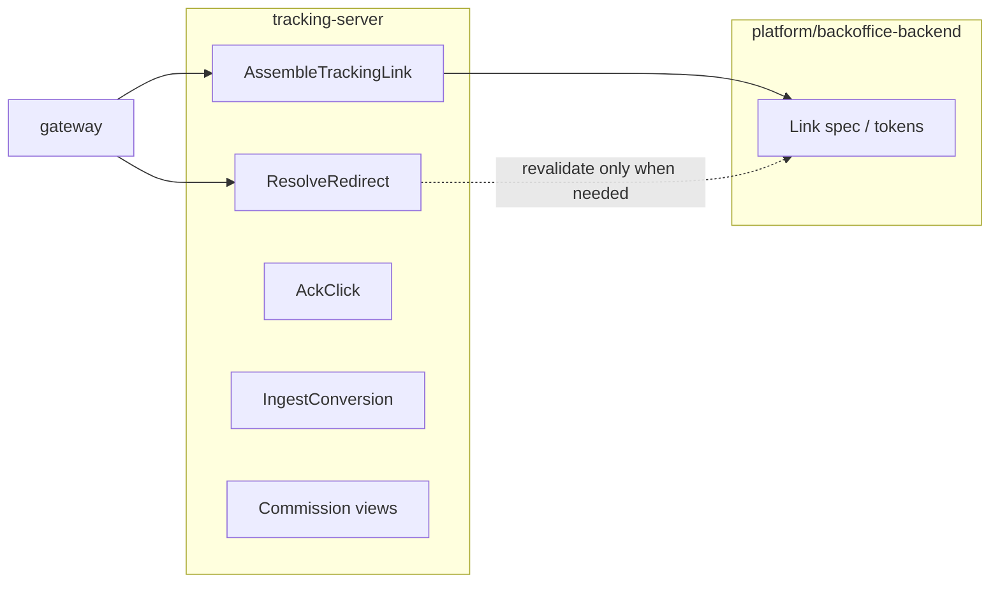

# tracking-server — internal API (`proto` / RPC)

This document is the **delivery-ready** contract for `tracking-server` internal services. **`gateway`** maps public HTTPS + JSON to these RPCs; shared external semantics use **`snake_case`** and names such as `landing_url`, `click_id`, `guide_card_id`, `recommendation_id`, `scene` per `.cursor/rules/shared-contracts.mdc`.

**Orientation**

- **Owns**: click recording, controlled redirect / short-token resolution, attribution snapshots, conversion ingest, commission **read views** (dashboards—not legal settlement).
- **Does not own**: partner-specific URL grammar, signing algorithms, or partner API credentials (**platform/backoffice-backend**).

**Versioning**

- RPC package: `simple_living.tracking_server`.
- Source of truth for machine-readable definitions: `services/tracking-server/proto/tracking_server.proto`.
- Breaking changes → new package version; record in [changelog.md](./changelog.md).

---

## 1. Services and RPCs

### 1.1 `TrackingLinkService`

| RPC | Request | Response | Idempotency |
|-----|---------|----------|-------------|
| `AssembleTrackingLink` | `AssembleTrackingLinkRequest` | `AssembleTrackingLinkResponse` | Same `idempotency_key` → same `link_ref` within TTL |

### 1.2 `TrackingRedirectService`

| RPC | Request | Response | Idempotency |
|-----|---------|----------|-------------|
| `ResolveRedirect` | `ResolveRedirectRequest` | `ResolveRedirectResponse` | Click: at most one primary fact per policy key (see §4.1 and §10) |

### 1.3 `TrackingClickService`

| RPC | Request | Response | Idempotency |
|-----|---------|----------|-------------|
| `AckClick` | `AckClickRequest` | `AckClickResponse` | `idempotency_key` |

### 1.4 `TrackingConversionService`

| RPC | Request | Response | Idempotency |
|-----|---------|----------|-------------|
| `IngestConversion` | `IngestConversionRequest` | `IngestConversionResponse` | `(source, external_event_id)` unique |

### 1.5 `TrackingCommissionViewService`

| RPC | Request | Response | Idempotency |
|-----|---------|----------|-------------|
| `GetCommissionSummary` | `GetCommissionSummaryRequest` | `GetCommissionSummaryResponse` | Read |
| `ListCommissionItems` | `ListCommissionItemsRequest` | `ListCommissionItemsResponse` | Cursor pagination |

### 1.6 Authentication & trust boundary

`tracking-server` is an **internal brpc service**; it is never exposed to the public internet directly. Identity is resolved by `gateway` (user/guest from `Authorization`, ops actor for back-office) and **passed through**; tracking does not validate login tokens itself. Per-RPC requirements:

| RPC | Caller | Auth requirement |
|-----|--------|------------------|
| `AssembleTrackingLink` | gateway (on behalf of end user/guest) | No role required; `user_id` is optional pass-through. Trust boundary: only cluster-internal callers. |
| `ResolveRedirect` | gateway edge / redirect endpoint | Public-traffic-facing via gateway `/t/{short_token}`; no user auth required (guests jump too). Anti-abuse is rate-control, not identity. |
| `AckClick` | gateway (client SDK) | Same as resolve; no role required. |
| `IngestConversion` | tracking-owned async consumer / affiliate relay | **Trusted internal caller only.** Must originate from the affiliate→tracking relay or an authenticated ops/postback router; gateway must not expose this to end users. `CONVERSION_SOURCE_MANUAL_ADJUSTMENT` requires an ops actor (role-checked at gateway/governance). |
| `GetCommissionSummary` / `ListCommissionItems` | gateway (ops dashboard / creator console) | **Operational/role-scoped read.** Caller identity (ops or creator `user_id`) is injected by gateway; tracking filters by the provided subject and does not widen scope. |

Connection strings, signing keys and partner secrets come from deploy-time secrets/env, never from the repo or request bodies (see [development.md](./development.md) §security).

---

## 2. Enums

### 2.1 `TrackingLinkStatus`

| Value | Meaning |
|-------|---------|
| `TRACKING_LINK_STATUS_UNSPECIFIED` | |
| `TRACKING_LINK_STATUS_ACTIVE` | Usable |
| `TRACKING_LINK_STATUS_EXPIRED` | Past `expires_at` |
| `TRACKING_LINK_STATUS_REVOKED` | Operational revoke |

### 2.2 `RedirectDisposition`

| Value | Meaning |
|-------|---------|
| `REDIRECT_DISPOSITION_UNSPECIFIED` | |
| `REDIRECT_DISPOSITION_HTTP_302` | Standard redirect to partner URL |
| `REDIRECT_DISPOSITION_JSON_BODY` | Controlled client: body carries target (gateway may restrict) |
| `REDIRECT_DISPOSITION_GONE` | Expired / revoked; no partner URL |

### 2.3 `ConversionSource`

| Value | Meaning |
|-------|---------|
| `CONVERSION_SOURCE_UNSPECIFIED` | Invalid |
| `CONVERSION_SOURCE_PARTNER_POSTBACK` | Partner callback |
| `CONVERSION_SOURCE_AFFILIATE_DOMAIN` | Normalized event from affiliate pipeline |
| `CONVERSION_SOURCE_MANUAL_ADJUSTMENT` | Ops correction |

### 2.4 `ConversionType`

| Value | Meaning |
|-------|---------|
| `CONVERSION_TYPE_UNSPECIFIED` | |
| `CONVERSION_TYPE_ORDER_PAID` | Paid order |
| `CONVERSION_TYPE_LEAD` | Lead / registration |
| `CONVERSION_TYPE_INSTALL` | App install |

### 2.5 `ConversionIngestStatus`

| Value | Meaning |
|-------|---------|
| `CONVERSION_INGEST_STATUS_UNSPECIFIED` | |
| `CONVERSION_INGEST_STATUS_ACCEPTED` | New row |
| `CONVERSION_INGEST_STATUS_DUPLICATE` | Idempotent replay |
| `CONVERSION_INGEST_STATUS_UNMATCHED` | No click match per policy |

### 2.6 `MatchConfidence`

| Value | Meaning |
|-------|---------|
| `MATCH_CONFIDENCE_UNSPECIFIED` | |
| `MATCH_CONFIDENCE_EXACT` | Direct `click_id` |
| `MATCH_CONFIDENCE_INFERRED` | Heuristic / attribution match |
| `MATCH_CONFIDENCE_UNMATCHED` | No attribution |

### 2.7 `CommissionSummaryGranularity`

| Value | Meaning |
|-------|---------|
| `COMMISSION_SUMMARY_GRANULARITY_UNSPECIFIED` | |
| `COMMISSION_SUMMARY_GRANULARITY_DAY` | Daily buckets |
| `COMMISSION_SUMMARY_GRANULARITY_WEEK` | Weekly buckets |

### 2.8 `TrackingErrorCode`

| Code | gRPC | When |
|------|------|------|
| `TRACKING_ERROR_CODE_UNSPECIFIED` | `INTERNAL` | |
| `TRACKING_ERROR_CODE_INVALID_TOKEN` | `NOT_FOUND` / `UNAUTHENTICATED` | Short token invalid |
| `TRACKING_ERROR_CODE_LINK_EXPIRED` | `FAILED_PRECONDITION` | |
| `TRACKING_ERROR_CODE_AFFILIATE_CONTEXT_INVALID` | `INVALID_ARGUMENT` | Bad `affiliate_context_ref` |
| `TRACKING_ERROR_CODE_AFFILIATE_SPEC_FAILED` | `FAILED_PRECONDITION` | Affiliate RPC failed |
| `TRACKING_ERROR_CODE_RATE_LIMITED` | `RESOURCE_EXHAUSTED` | |
| `TRACKING_ERROR_CODE_DUPLICATE_CONVERSION` | `ALREADY_EXISTS` | Same external id |

---

## 3. Messages — link assembly

### 3.1 `AssembleTrackingLinkRequest`

| Field | Type | Required | Description |
|-------|------|----------|-------------|
| `content_ref` | `ContentRef` | yes | Stable content identity |
| `placement` | `string` | yes | e.g. `feed`, `detail`, `search` |
| `affiliate_context_ref` | `string` | yes | Opaque handle issued by an affiliate-owned provisioning / publish pipeline; it must be expandable into affiliate `LinkGenerationInput` (`partner_id`, `campaign_ref`, `product_refs`, `sub_ids`, `placement`, `compliance_context`) and never contains raw partner secrets |
| `device_context` | `DeviceContext` | no | Client capabilities |
| `idempotency_key` | `string` | recommended | Per user gesture |
| `user_id` | `string` | no | If authenticated |
| `landing_url` | `string` | v1 CMS bridge only | Gateway passes the provider-owned URL read from snapshot while affiliate 模块 URL generation is not stable. Remove this bridge after `affiliate_context_ref` provisioning is fully online. |
| `device_id` | `string` | no | Stable device id |

### 3.2 `ContentRef`

| Field | Type | Description |
|-------|------|-------------|
| `content_id` | `string` | |
| `guide_card_id` | `string` | Card id when applicable |
| `recommendation_id` | `string` | From recommendation feed |
| `scene` | `string` | Recommendation scene |
| `item_rank` | `int32` | List position |

### 3.3 `DeviceContext`

| Field | Type | Description |
|-------|------|-------------|
| `client_platform` | `string` | Align with auth contract (`ios`, `android`, `web`, `mini_program`, …) |
| `app_version` | `string` | |
| `webview_user_agent` | `string` | Truncated per policy |

### 3.4 `AssembleTrackingLinkResponse`

| Field | Type | Description |
|-------|------|-------------|
| `landing_url` | `string` | **HTTPS** URL the client opens; maps 1:1 to public JSON |
| `expires_at` | `google.protobuf.Timestamp` | |
| `redirect_hint` | `RedirectHint` | Optional native / mini-program hints |
| `attribution_echo` | `AttributionPayload` | Non-sensitive subset for client logging |
| `link_ref` | `string` | Server-side assembly id |
| `short_token` | `string` | Public opaque token for `/t/{short_token}` |

### 3.5 `RedirectHint`

| Field | Type | Description |
|-------|------|-------------|
| `app_scheme` | `string` | |
| `universal_link` | `string` | |
| `mini_program_path` | `string` | |

---

## 4. Messages — redirect resolution

### 4.1 `ResolveRedirectRequest`

| Field | Type | Required | Description |
|-------|------|----------|-------------|
| `short_token` | `string` | yes | From URL; always the public routing key for v1 redirect requests |
| `signed_blob` | `bytes` | no | Tracking-owned signed envelope used to avoid or reduce KV lookups after token routing; it may carry `link_ref`, `affiliate_context_ref`, `spec_id`, expiry and non-secret attribution snapshot, but must not embed raw partner credentials or token values. Claim-level shape follows `./data-model.md` §3 (`link_ref`, `exp`, `sig`, `ver`); exact byte encoding and key management remain provider-owned |
| `request_format` | `RedirectRequestFormat` | no | `REDIRECT` vs `JSON` |
| `client_ip_hash` | `string` | no | Privacy-preserving digest |
| `user_agent` | `string` | no | Truncated |
| `device_dedup_key` | `string` | no | Idempotent click policy |

When `device_dedup_key` is omitted, v1 does not create a global `(short_token, "")` dedup key. The request may still create a click fact, subject only to other anti-abuse or rate-control policies.

### 4.2 `RedirectRequestFormat`

| Value | Meaning |
|-------|---------|
| `REDIRECT_REQUEST_FORMAT_UNSPECIFIED` | Default redirect |
| `REDIRECT_REQUEST_FORMAT_REDIRECT` | HTTP redirect response path |
| `REDIRECT_REQUEST_FORMAT_JSON` | JSON body path for controlled clients |

### 4.3 `ResolveRedirectResponse`

| Field | Type | Description |
|-------|------|-------------|
| `disposition` | `RedirectDisposition` | |
| `http_location` | `string` | Partner URL when `HTTP_302` |
| `click_id` | `string` | Assigned when click recorded |
| `redirect_state` | `string` | Machine code for errors (`expired`, `invalid_token`, …) |
| `json_body` | `ResolveRedirectJsonBody` | When `JSON_BODY` |

### 4.4 `ResolveRedirectJsonBody`

| Field | Type | Description |
|-------|------|-------------|
| `landing_url` | `string` | Echo or alternate surface |
| `partner_url` | `string` | Final outbound URL |
| `click_id` | `string` | |

---

## 5. Messages — click acknowledgment

### 5.1 `AckClickRequest`

| Field | Type | Required | Description |
|-------|------|----------|-------------|
| `link_ref` | `string` | one-of | |
| `short_token` | `string` | one-of | |
| `opened_at` | `google.protobuf.Timestamp` | yes | Client-observed open time |
| `idempotency_key` | `string` | yes | |

`AckClick` is the client-observed open acknowledgment path and is mainly used when the app opens `landing_url` but the eventual partner redirect is handled elsewhere (for example native deep-link handoff or webview lifecycle callback). It must not create a second logical click if `ResolveRedirect` has already recorded the primary click fact for the same resolved link.

### 5.2 `AckClickResponse`

| Field | Type | Description |
|-------|------|-------------|
| `click_id` | `string` | Created or existing |

---

## 6. Messages — attribution (canonical snapshot)

### 6.1 `AttributionPayload`

Aligned with [data-model.md](./data-model.md); **no secrets**. This section is the authoritative RPC-level mapping for v1 tracking callers.

| Field | Type | Description |
|-------|------|-------------|
| `click_id` | `string` | After click exists |
| `link_ref` | `string` | |
| `content_id` | `string` | |
| `guide_card_id` | `string` | |
| `placement` | `string` | |
| `channel_code` | `string` | Stable outbound channel code, e.g. `pdd`, `douyin`; in v1 it defaults to affiliate `partner_id` unless an explicit alias mapping is documented upstream |
| `recommendation_id` | `string` | |
| `scene` | `string` | |
| `item_rank` | `int32` | |
| `campaign_slot` | `string` | Mirrors affiliate `LinkGenerationInput.campaign_ref` |
| `sub_id_1` | `string` | Mirrors affiliate `sub_ids["sub_id_1"]` |
| `sub_id_2` | `string` | Mirrors affiliate `sub_ids["sub_id_2"]` |
| `sub_id_3` | `string` | Mirrors affiliate `sub_ids["sub_id_3"]` |

v1 only promotes `sub_id_1..3` into tracking attribution snapshots. Additional affiliate sub slots may exist upstream but are not guaranteed to survive into this contract.

---

## 7. Messages — conversion ingest

### 7.1 `IngestConversionRequest`

| Field | Type | Required | Description |
|-------|------|----------|-------------|
| `source` | `ConversionSource` | yes | |
| `external_event_id` | `string` | yes | Source idempotency; for `CONVERSION_SOURCE_AFFILIATE_DOMAIN`, use `CommissionNormalizedEvent.event_id` |
| `occurred_at` | `google.protobuf.Timestamp` | yes | Partner time |
| `click_id` | `string` | no* | For affiliate events, prefer `CommissionNormalizedEvent.correlation_hints.click_id` when present |
| `attribution` | `AttributionPayload` | no* | For inference; affiliate-originated events map `campaign_ref` / `sub_ids` into this snapshot |
| `conversion_type` | `ConversionType` | yes | v1 affiliate normalized events use `CONVERSION_TYPE_ORDER_PAID` |
| `amount` | `MoneyMinor` | no | |
| `commission` | `CommissionMinor` | no | For affiliate normalized events, populate from `amount_minor` + `currency`; use `estimate = true` for `PENDING`, `false` for `CONFIRMED` |
| `raw_payload_ref` | `string` | no | Storage pointer |

\* Policy: require `click_id` **or** sufficient `attribution` to resolve or deliberately store unmatched. For generic v1 sources, "sufficient attribution" means at least `channel_code`, one of `content_id` / `guide_card_id`, and at least one of `campaign_slot` / `sub_id_1` / `sub_id_2` / `sub_id_3`. For `CONVERSION_SOURCE_AFFILIATE_DOMAIN`, if `click_id` is absent the event may still be accepted as `UNMATCHED` with sparse affiliate attribution (`channel_code` plus any available `campaign_slot` / `sub_id_*`); content anchors are recommended but not mandatory.

**backoffice-backend affiliate snapshot mapping (v1):**

- `source = CONVERSION_SOURCE_AFFILIATE_DOMAIN`
- `external_event_id = CommissionNormalizedEvent.event_id`
- `attribution.channel_code = CommissionNormalizedEvent.partner_id` unless an explicit upstream alias mapping is documented
- `occurred_at = CommissionNormalizedEvent.occurred_at`
- `click_id = CommissionNormalizedEvent.correlation_hints.click_id` if present
- `attribution.campaign_slot` is recovered from the persisted link/click attribution snapshot referenced by `click_id`; if `click_id` is absent or unmatched, leave `campaign_slot` empty
- `attribution.sub_id_1..3` should prefer the persisted link/click attribution snapshot when `click_id` resolves; `CommissionNormalizedEvent.correlation_hints.sub_ids["sub_id_1".."sub_id_3"]` act as fallback and audit inputs
- `commission.currency/value_minor/estimate = currency / amount_minor / (status == COMMISSION_EVENT_STATUS_PENDING)`
- `amount` may be empty when affiliate-side data contains commission only and not gross order amount
- if `click_id` is absent, the consumer may still call `IngestConversion`; tracking should persist the row as `CONVERSION_INGEST_STATUS_UNMATCHED` unless other attribution rules later resolve it
- `CommissionEventStatus.REVERSED` / `INVALID` must not be ingested as new positive conversion facts through this v1 RPC path; they belong to reversal / adjustment handling outside `IngestConversion`
- conflicts between persisted click attribution and incoming affiliate correlation hints must not cause hard ingest failure on the v1 path; tracking should trust its persisted snapshot, retain the incoming hints for audit, and continue ingest unless another validation rule fails

### 7.2 `MoneyMinor`

| Field | Type | Description |
|-------|------|-------------|
| `currency` | `string` | ISO 4217 |
| `value_minor` | `int64` | Integer minor units |

### 7.3 `CommissionMinor`

| Field | Type | Description |
|-------|------|-------------|
| `currency` | `string` | |
| `value_minor` | `int64` | |
| `estimate` | `bool` | |

### 7.4 `IngestConversionResponse`

| Field | Type | Description |
|-------|------|-------------|
| `conversion_id` | `string` | |
| `matched_click_id` | `string` | If resolved |
| `status` | `ConversionIngestStatus` | |
| `match_confidence` | `MatchConfidence` | |

---

## 8. Messages — commission views

### 8.1 `GetCommissionSummaryRequest`

| Field | Type | Required | Description |
|-------|------|----------|-------------|
| `from_time` | `google.protobuf.Timestamp` | yes | |
| `to_time` | `google.protobuf.Timestamp` | yes | |
| `granularity` | `CommissionSummaryGranularity` | yes | |
| `content_ref` | `ContentRef` | no | Optional filter |
| `user_id` | `string` | no | Dashboard subject |

### 8.2 `CommissionSummaryBucket`

| Field | Type | Description |
|-------|------|-------------|
| `bucket_start` | `google.protobuf.Timestamp` | |
| `estimated_minor` | `int64` | Sum of rows where `commission.estimate = true` |
| `reported_minor` | `int64` | Sum of rows where `commission.estimate = false` |
| `currency` | `string` | |
| `order_count` | `int32` | |

### 8.3 `GetCommissionSummaryResponse`

| Field | Type | Description |
|-------|------|-------------|
| `buckets` | `repeated CommissionSummaryBucket` | |

### 8.4 `ListCommissionItemsRequest`

| Field | Type | Required | Description |
|-------|------|----------|-------------|
| `pagination` | `CursorPagination` | yes | `cursor`, `limit` per `.cursor/rules/shared-contracts.mdc` |
| `user_id` | `string` | no | |
| `conversion_id` | `string` | no | Filter |
| `click_id` | `string` | no | Filter |

### 8.5 `CursorPagination`

| Field | Type | Description |
|-------|------|-------------|
| `cursor` | `string` | Opaque; empty for first page |
| `limit` | `int32` | Max 100 |

### 8.6 `PaginationMeta`

| Field | Type | Description |
|-------|------|-------------|
| `next_cursor` | `string` | |
| `has_more` | `bool` | |

### 8.7 `CommissionLineItem`

| Field | Type | Description |
|-------|------|-------------|
| `conversion_id` | `string` | |
| `click_id` | `string` | |
| `occurred_at` | `google.protobuf.Timestamp` | |
| `commission_minor` | `int64` | |
| `currency` | `string` | |
| `conversion_type` | `ConversionType` | |

### 8.8 `ListCommissionItemsResponse`

| Field | Type | Description |
|-------|------|-------------|
| `items` | `repeated CommissionLineItem` | |
| `pagination` | `PaginationMeta` | Mirrors shared `data.pagination` shape at gateway boundary |

---

## 9. Error semantics

### 9.1 Error payload shape

Failures SHOULD use `google.rpc.Status` plus optional `TrackingErrorDetail`:

| Field | Type | Description |
|-------|------|-------------|
| `code` | `TrackingErrorCode` | Internal enum (§2.8) |
| `public_code` | `int32` | 5-digit shared-contract code (§9.2) carried for gateway mapping |
| `link_ref` | `string` | When relevant |
| `retryable` | `bool` | |

### 9.2 Public error-code mapping (shared contract)

Internal RPC returns a non-OK status; `gateway` maps it to the public envelope `code` per `.cursor/rules/shared-contracts.mdc`. This domain uses the **affiliate & redirect `50xxx`** band, plus generic `10xxx` and system `90xxx`. Same semantic keeps the same number across versions; this band is append-only.

| Public `code` | HTTP | Internal `TrackingErrorCode` / trigger |
|---------------|------|----------------------------------------|
| `0` | 200 | Success |
| `10001` | 400 | Missing required parameter (e.g. no `short_token` / `affiliate_context_ref`) |
| `10002` | 400 | Validation failed — incl. `TRACKING_ERROR_CODE_AFFILIATE_CONTEXT_INVALID` (placement mismatch, bad `affiliate_context_ref`) |
| `10005` | 429 | Rate limited — `TRACKING_ERROR_CODE_RATE_LIMITED` (edge throttle on resolve) |
| `10007` | 409 | Version conflict / stale write — optimistic-lock or idempotency semantic conflict (§9.3) |
| `50001` | 503 | Channel unavailable — affiliate channel/partner not currently usable |
| `50002` | 502/500 | Link generation / spec resolution failed — `TRACKING_ERROR_CODE_AFFILIATE_SPEC_FAILED` |
| `50003` | 410 | Link expired / revoked — `TRACKING_ERROR_CODE_LINK_EXPIRED`, `TRACKING_ERROR_CODE_INVALID_TOKEN`, disposition `GONE` |
| `90001` | 500 | Internal error |
| `90002` | 504 | Downstream (affiliate) timeout |
| `90003` | 502 | Downstream (affiliate) error |

`DUPLICATE_CONVERSION` is **not** a client error: a replayed `(source, external_event_id)` returns success with `status=CONVERSION_INGEST_STATUS_DUPLICATE` (§7.4), `code=0`. `UNMATCHED` is likewise a normal accepted outcome, not an error.

### 9.3 Idempotency & optimistic lock (definite codes)

- **`AssembleTrackingLink`:** same `idempotency_key` within TTL → same `link_ref`/`landing_url`, `code=0` (no second row). Same key + materially different request body (semantic conflict) → **`10007`**, second assembly not performed.
- **`IngestConversion` (conversion postback):** idempotent by **`(source, external_event_id)`**; for partner order postbacks `external_event_id` carries `external_order_id`, for the affiliate path it is `CommissionNormalizedEvent.event_id`. When `click_id` is supplied it is the primary correlation key. Replay → existing `conversion_id` + `DUPLICATE`, `code=0`. A same-key event whose immutable fields (amount/currency/type) conflict with the stored fact → **`10007`** (stale/conflicting write), the stored fact wins.
- **`ResolveRedirect` click dedup:** at most one primary click per `(short_token, device_dedup_key)` (data-model `uq_click_dedup`); a duplicate collapses to the existing `click_id`, not an error.
- **Idempotency window:** the click/idempotency window is held in Redis (`-redis_addr` / `-redis_ttl_ms`) with the PostgreSQL unique indexes as the durable fallback; on Redis miss the DB constraint still guarantees correctness.

---

## 10. Idempotency and ordering

| Surface | Rule |
|---------|------|
| `AssembleTrackingLink` | Same `idempotency_key` → same `link_ref` / URL within TTL |
| `ResolveRedirect` | At most one primary **click** per `(short_token, device_dedup_key)` per policy |
| `IngestConversion` | `(source, external_event_id)` unique |

---

## 11. Integration notes

### 11.1 **platform/backoffice-backend**

- Assembly path accepts `affiliate_context_ref` as an upstream opaque pass-through value issued by affiliate-owned provisioning, resolves it into one canonical affiliate `LinkGenerationInput`, then calls `ValidateLinkGenerationInput` (or an equivalent cached spec) to obtain `AffiliateLinkSpec`, and finally builds **`landing_url`** and signed token payload **in tracking** using that spec.
- `placement` follows request-first semantics: `AssembleTrackingLinkRequest.placement` is the source of truth for tracking attribution. If the expanded `affiliate_context_ref` also carries `placement`, the two values must match; otherwise return `TRACKING_ERROR_CODE_AFFILIATE_CONTEXT_INVALID`.
- Tracking **never** embeds partner API secrets in client-visible URLs; token acquisition stays in affiliate adapters.
- After `AssembleTrackingLink`, tracking must persist enough state for redirect-time materialization: at minimum `link_ref`, `short_token`, `affiliate_context_ref`, the effective spec reference (`spec_id` or an equivalent materialized spec snapshot), `expires_at`, and the non-secret attribution snapshot.
- `ResolveRedirect` first uses persisted tracking state to materialize `partner_url`; only when the stored spec/token material is expired, insufficient, or policy-marked refreshable should it re-enter the affiliate resolution path.
- v1 does **not** assume any extra public affiliate RPC for redirect-time refresh. If the previously validated spec expires or needs refreshed token material, tracking must either re-run the same `affiliate_context_ref -> LinkGenerationInput -> ValidateLinkGenerationInput` path or rely on affiliate private adapter capability explicitly owned inside platform/backoffice-backend.
- Successful redirect-time URL assembly must not depend on an undocumented handle-to-string API. If a validated `AffiliateLinkSpec` still contains `REF_TOKEN` bindings that cannot be materialized after the allowed revalidation path, tracking must fail with `TRACKING_ERROR_CODE_AFFILIATE_SPEC_FAILED` rather than guessing another integration path.
- Mapping convention is fixed across domains: affiliate `campaign_ref -> campaign_slot`, affiliate `sub_ids["sub_id_1".."sub_id_3"] -> AttributionPayload.sub_id_1..3`.
- `signed_blob` is a tracking envelope, not a serialized `AffiliateLinkSpec`; it carries only what tracking needs to rehydrate link state and re-enter the affiliate resolution path.
- Tracking is not expected to parse the byte-level encoding of `affiliate_context_ref` itself. It stores and forwards the opaque value and must use the affiliate-owned resolver/helper co-versioned with provisioning when expansion into `LinkGenerationInput` is required. In monorepo v1 this helper is treated as an affiliate-owned implementation module, not a separate public RPC.
- `CommissionNormalizedEvent` is consumed by a tracking-owned async worker / relay, which invokes `IngestConversion`. Retry is keyed by affiliate `event_id`, while RPC idempotency remains `(source, external_event_id)`. Because affiliate duplicate webhook handling suppresses second publish, the consumer should treat repeated delivery as transport replay, not as a new business fact. The transport payload is the provider-owned `CommissionNormalizedEvent` message; topic / queue names and DLQ policy are deployment configuration, not part of this API contract.
- `ResolveRedirect` owns the primary redirect-time click creation path. `AckClick` is a supplemental acknowledgment path and must reuse existing click state when one already exists for the same resolved link / idempotency scope.
- Reversal / adjustment handling is explicitly outside the v1 positive-conversion RPC surface documented here; implementers of the main affiliate->tracking path do not need to invent an extra RPC in this task.

### 11.2 **gateway**

- Owns HTTPS routes, envelopes, HTTP status codes, and JSON **`snake_case`** mapping.
- Public list responses place pagination under `data.pagination` per shared contracts.

### 11.3 **contracts**

- Redirect / attribution field semantics: `.cursor/rules/shared-contracts.mdc`.
- Pagination: `.cursor/rules/shared-contracts.mdc`.

---

## 12. Context diagram



## Appendix A. Request / response examples

The examples below use **proto-text** to mirror internal message structure more directly. Actual wire transport remains `proto2 + gRPC`; enum values are shown by symbolic name and `Timestamp` values are illustrated in message form.

### A.1 `AssembleTrackingLink`

#### Request (`textproto`)

```textproto
content_ref {
  content_id: "guide_card_1001"
  guide_card_id: "guide_card_1001"
  recommendation_id: "rec_01HSZ15H0N8HG9P5P2E0"
  scene: "home_feed"
  item_rank: 1
}
placement: "feed"
affiliate_context_ref: "affctx_01HSZ3M4YF4V1G7N9P2D"
device_context {
  client_platform: "ios"
  app_version: "1.4.2"
  webview_user_agent: "Shaotang/1.4.2"
}
idempotency_key: "click_prepare_01HSZ3P2E3Q7P9V5R1K2"
user_id: "user_01HSYQK5PZ4K4J9R2M8D"
device_id: "device_9f1b5e18"
```

#### Response (`textproto`)

```textproto
landing_url: "https://api.simpleliving.app/t/st_2f93ab"
expires_at {
  seconds: 1774700400
}
redirect_hint {
  app_scheme: "simpleliving://redirect/st_2f93ab"
  universal_link: "https://m.simpleliving.app/t/st_2f93ab"
  mini_program_path: "/pages/redirect?token=st_2f93ab"
}
attribution_echo {
  link_ref: "link_01HSZ3R7AD6M0N6F5J8A"
  content_id: "guide_card_1001"
  guide_card_id: "guide_card_1001"
  placement: "feed"
  channel_code: "pdd"
  recommendation_id: "rec_01HSZ15H0N8HG9P5P2E0"
  scene: "home_feed"
  item_rank: 1
  campaign_slot: "campaign_spring_2026"
}
link_ref: "link_01HSZ3R7AD6M0N6F5J8A"
short_token: "st_2f93ab"
```

### A.2 `ResolveRedirect`

#### Request (`textproto`)

```textproto
short_token: "st_2f93ab"
request_format: REDIRECT_REQUEST_FORMAT_JSON
client_ip_hash: "sha256:1ae0f4..."
user_agent: "Mozilla/5.0"
device_dedup_key: "ios:device_9f1b5e18"
```

#### Response (`textproto`)

```textproto
disposition: REDIRECT_DISPOSITION_JSON_BODY
click_id: "click_01HSZ3Y8W7W5S5Y6R3B1"
redirect_state: "ok"
json_body {
  landing_url: "https://api.simpleliving.app/t/st_2f93ab"
  partner_url: "https://mobile.yangkeduo.com/goods.html?goods_id=893245001"
  click_id: "click_01HSZ3Y8W7W5S5Y6R3B1"
}
```

### A.3 `ListCommissionItems`

#### Request (`textproto`)

```textproto
pagination {
  cursor: ""
  limit: 20
}
user_id: "user_01HSYQK5PZ4K4J9R2M8D"
```

#### Response (`textproto`)

```textproto
items {
  conversion_id: "conv_01HSZ44D5J4P1M8H6X9V"
  click_id: "click_01HSZ3Y8W7W5S5Y6R3B1"
  occurred_at {
    seconds: 1774700280
  }
  commission_minor: 1280
  currency: "CNY"
  conversion_type: CONVERSION_TYPE_ORDER_PAID
}
pagination {
  next_cursor: "cursor_comm_01HSZ44D5J4P1M8H6X9V"
  has_more: true
}
```

### A.4 `AckClick`

#### Request (`textproto`)

```textproto
link_ref: "link_01HSZ3R7AD6M0N6F5J8A"
opened_at {
  seconds: 1774700220
}
idempotency_key: "ack_01HSZC2M6P4Q8N1V5K3T"
```

#### Response (`textproto`)

```textproto
click_id: "click_01HSZ3Y8W7W5S5Y6R3B1"
```

### A.5 `IngestConversion`

#### Request (`textproto`)

```textproto
source: CONVERSION_SOURCE_AFFILIATE_DOMAIN
external_event_id: "cnevt_01HSZ2KFC8AJR0W3N8VA"
occurred_at {
  seconds: 1774700280
}
click_id: "click_01HSZ3Y8W7W5S5Y6R3B1"
conversion_type: CONVERSION_TYPE_ORDER_PAID
commission {
  currency: "CNY"
  value_minor: 1280
  estimate: false
}
```

#### Response (`textproto`)

```textproto
conversion_id: "conv_01HSZ44D5J4P1M8H6X9V"
matched_click_id: "click_01HSZ3Y8W7W5S5Y6R3B1"
status: CONVERSION_INGEST_STATUS_ACCEPTED
match_confidence: MATCH_CONFIDENCE_EXACT
```

### A.6 `GetCommissionSummary`

#### Request (`textproto`)

```textproto
from_time {
  seconds: 1774617600
}
to_time {
  seconds: 1774704000
}
granularity: COMMISSION_SUMMARY_GRANULARITY_DAY
user_id: "user_01HSYQK5PZ4K4J9R2M8D"
```

#### Response (`textproto`)

```textproto
buckets {
  bucket_start {
    seconds: 1774617600
  }
  estimated_minor: 1280
  reported_minor: 1280
  currency: "CNY"
  order_count: 1
}
```
